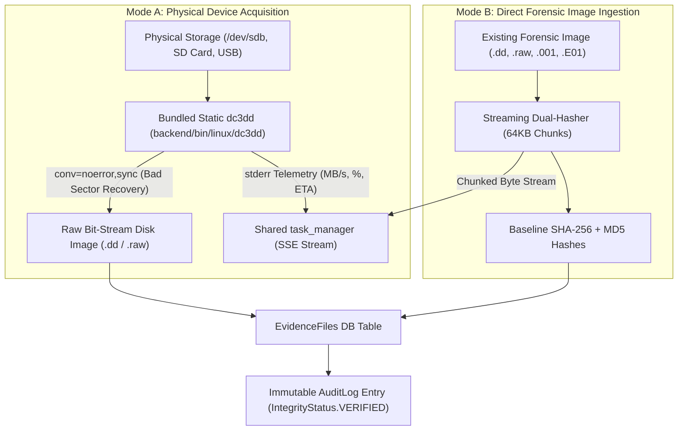

# 📥 Flow 01: Physical Acquisition & Image Ingestion

> **Module:** `backend/app/modules/acquisition/`  
> **Status:** `✅ Completed (13/13 Tests Passing)`  
> **Purpose:** Perform court-admissible forensic bit-stream disk imaging via bundled `dc3dd`, direct forensic image ingestion, dual-hash verification (SHA-256 + MD5), and immutable chain-of-custody audit logging.

---

## 🎯 High-Level Architecture & Acquisition Pipelines

The Locus Acquisition engine supports two ingestion workflows:



---

## 🛡️ Key Features & Forensic Protections

| Feature | Technical Implementation | Forensic Justification |
| :--- | :--- | :--- |
| **Bundled Static `dc3dd`** | Statically compiled ELF inside `backend/bin/linux/` (Windows `.exe` + `cygwin1.dll`) | Zero host installation requirement; avoids GNU GPL license conflicts via clean subprocess boundary. |
| **Hardware Bad Sector Defense** | Executed with flags `conv=noerror,sync` | Prevents acquisition aborts on failing CCTV spinning drives by zero-padding dead sectors. |
| **Dual Cryptographic Hashing** | Streaming chunked dual-hasher (`hasher.py`) computing **SHA-256 + MD5** simultaneously | Satisfies international court admissibility standards (Federal Rules of Evidence Rule 902). |
| **Memory-Safe Streaming** | Processed in 64 KB memory chunks (`iter(lambda: f.read(65536), b"")`) | Prevents RAM exhaustion when hashing massive 500 GB – 4 TB disk images. |
| **Real-time SSE Progress** | Integrated with `app.core.task_manager` broadcasting percent, rate, and ETA | Real-time visual feedback in UI without blocking FastAPI server. |
| **Immutable Chain of Custody** | Automatic insertion into `audit_logs` table with `action="CASE_INGESTION"` | Cryptographically documents who acquired the evidence, when, and baseline hash values. |

---

## 🗂️ Module File Structure

```text
backend/app/
├── bin/
│   ├── linux/dc3dd             # Static ELF binary (zero dependencies)
│   └── windows/dc3dd.exe       # Windows binary + cygwin1.dll
│
├── core/
│   └── task_manager.py         # Shared async task & SSE streaming engine
│
└── modules/acquisition/
    ├── dc3dd.py                # Subprocess runner & stderr regex parser
    ├── hasher.py               # Chunked streaming dual-hash engine (SHA-256 + MD5)
    ├── schemas.py              # Pydantic request/response validation models
    ├── service.py              # Ingestion & cloning async background workers
    └── router.py               # REST API endpoints & SSE progress streaming
```

---

## 📡 REST API Endpoints

| Endpoint | Method | Status Code | Description |
| :--- | :--- | :--- | :--- |
| `/api/v1/acquisition/ingest-file` | `POST` | `202 Accepted` | Ingests an existing `.dd`/`.raw`/`.E01` disk image, verifies path, and computes baseline hashes in background. |
| `/api/v1/acquisition/clone` | `POST` | `202 Accepted` | Launches physical block-device cloning via `dc3dd`. |
| `/api/v1/acquisition/stream/{task_id}` | `GET` | `200 OK` (SSE) | Real-time Server-Sent Events stream for progress bar, transfer rate, and completion status. |
| `/api/v1/acquisition/tasks` | `GET` | `200 OK` | Lists all active and recent acquisition background tasks. |
| `/api/v1/acquisition/tasks/{task_id}` | `GET` | `200 OK` | Retrieves detailed state of a specific acquisition task. |

---

## 🧪 Automated Test Verification (13 / 13 Passing)

All acquisition and ingestion workflows are verified in [`backend/tests/test_acquisition.py`](file:///home/rehanhalai/code/locus/backend/tests/test_acquisition.py):

1. `test_dc3dd_binary_path_resolution` $\rightarrow$ Validates locating bundled static `dc3dd` binary across platforms.
2. `test_parse_dc3dd_output_lines` $\rightarrow$ Validates parsing `dc3dd` stderr lines (bytes copied, %, speed MB/s).
3. `test_acquisition_task_routes` $\rightarrow$ Validates task creation, retrieval, and listing in TaskManager.
4. `test_start_clone_nonexistent_case_returns_404` $\rightarrow$ 404 guard for invalid case IDs.
5. `test_hasher_empty_file_zero_bytes` $\rightarrow$ Validates standard SHA-256 and MD5 hashes of 0-byte files.
6. `test_hasher_large_binary_chunked_stream` $\rightarrow$ Validates streaming hasher accuracy across multi-chunk files.
7. `test_ingest_image_file_async_task_lifecycle` $\rightarrow$ Full E2E file ingestion, background worker, and `EvidenceFiles` persistence.
8. `test_ingest_image_file_directory_path_returns_400` $\rightarrow$ Directory path guard returning 400 Bad Request.
9. `test_ingest_image_file_missing_path_returns_400` $\rightarrow$ Missing file path guard returning 400 Bad Request.
10. `test_ingest_image_file_missing_case_returns_404` $\rightarrow$ Missing case ID guard returning 404 Not Found.
11. `test_ingest_chain_of_custody_audit_log_persisted` $\rightarrow$ Verifies immutable `AuditLog` entry created with `IntegrityStatus.VERIFIED`.
12. `test_acquisition_stream_not_found_returns_404` $\rightarrow$ SSE stream guard returning 404 for invalid tasks.
13. `test_concurrent_ingestion_tasks` $\rightarrow$ Multiple concurrent disk ingestion tasks executed in parallel without race conditions.
