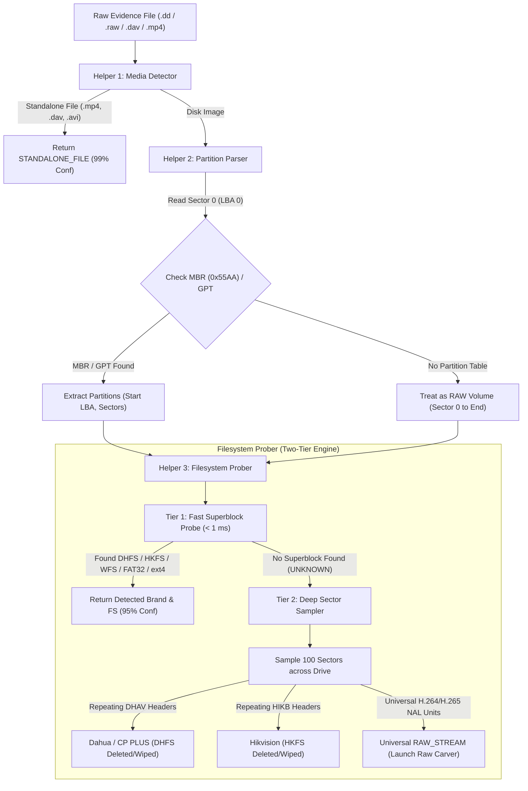

# 🔍 Flow 02: Device & File System Identification

> **Module:** `backend/app/modules/identification/`  
> **Status:** `✅ Completed (All 4 Steps Done, 51/51 Tests Passing)`  
> **Purpose:** Automatically detect the partition layout (MBR/GPT/RAW), proprietary DVR filesystem (DHFS, HKFS, WFS), or standard filesystem (FAT32, exFAT, ext4) from forensic disk images or exported media clips.

---

## 🎯 High-Level Architecture & Core Principles

The Locus identification engine is built with a **Two-Tier Resilient Detection Architecture** designed specifically for real-world forensic crime scenarios.



---

## 🛡️ Real-World Crime & Forensic Scenarios Handled

| Scenario | What Happened to Drive | How Locus Handles It | Forensic Outcome |
| :--- | :--- | :--- | :--- |
| **1. Healthy DVR Hard Drive** | Normal operation | **Tier 1 Fast Probe** finds `"DHFS"` or `"HKFS"` at Sector 2048 in < 1 ms | Exact vendor metadata & channels extracted |
| **2. Suspect Formatted DVR** | Sector 0 erased / cleared | **Tier 2 Deep Sampler** detects thousands of `DHAV` or `HIKB` frame packets deeper in unallocated space | Discovers wiped/deleted footage ready for carving |
| **3. Hardware Bad Sector 0** | Sector 0 physically dead | Deep scan bypasses broken Sector 0 and samples sectors 100+ | Identifies format and recovers remaining drive sectors |
| **4. Carved Sector Dump** | Sliced dump (e.g. Sectors 10,000–50,000) | Deep scan identifies repeating NAL units (`0x00000001` + SPS/IDR) | Flags as `RAW_STREAM` and launches raw video carver |
| **5. Unlisted / Obscure Brand** | Brand from unknown manufacturer | Deep scan identifies universal H.264 / H.265 video packets | Video is **100% playable** and carved without vendor branding |
| **6. Multi-Partition CCTV Drive** | OS partition + Video partition | Identifies both and automatically prioritizes proprietary DVR video partitions over standard OS boot partitions | Eliminates false-positive OS identification |

---

## 🏢 Vendor & Format Support Matrix

### 1. Dedicated DVR Vendors
* **Dahua Technology (`DVRBrand.DAHUA`):**
  * Superblock: `"DHFS"` (`0x44 0x48 0x46 0x53`)
  * Deep Frame Packets: `"DHAV"` (`0x44 0x48 0x41 0x56`) ... `"dhav"` footer
  * Standalone file: `.dav`
* **CP PLUS (`DVRBrand.CP_PLUS`):**
  * Uses Dahua OEM architecture (`DHFS` / `DHAV`).
* **Hikvision & EZVIZ (`DVRBrand.HIKVISION`):**
  * Superblock: `"HKFS"` (`0x48 0x4B 0x46 0x53`)
  * Master Index: `"HIKBTREE"` B+ tree table
  * Deep Cluster Blocks: `"HIKB"` (`0x48 0x49 0x4B 0x42`)
* **WFS / Swann / Xiongmai (`DVRBrand.WFS_GENERIC`):**
  * Superblock: `"WFS\x00"` (`0x57 0x46 0x53 0x00`) or `"WFS 0.4"`

### 2. Standard Storage & Backups
* **FAT32 (`FileSystemType.FAT32`):** MicroSD cards from Wi-Fi cameras (Tapo, Mi 360, dashcams).
* **exFAT (`FileSystemType.EXFAT`):** High-capacity 64GB+ SD cards.
* **NTFS (`FileSystemType.NTFS`):** Windows external backup drives.
* **Linux ext4 (`FileSystemType.EXT4`):** Embedded NVR operating system partitions.
* **Standalone Video Clips:** `.mp4` (`"ftyp"` box), `.avi` (`"RIFF"` header).

### 3. Universal Video Fallback (100% Brand Coverage)
* **Raw H.264 (AVC) Stream (`FileSystemType.RAW_STREAM`):** Start code `0x00000001` + SPS (`0x67`), PPS (`0x68`), IDR Keyframe (`0x65`), P-Frames (`0x41`/`0x61`).
* **Raw H.265 (HEVC / 4K) Stream (`FileSystemType.RAW_STREAM`):** Start code `0x00000001` + VPS (`0x40`), SPS (`0x42`), IDR Keyframes (`0x26`, `0x28`).

---

## 🗂️ Code Organization & Module Structure

```text
backend/app/
├── core/
│   ├── config.py               # Global environment config
│   └── task_manager.py         # 🌐 Shared async task & SSE streaming engine
│
└── modules/identification/
    ├── scanner.py              # High-level DeviceScanner orchestrator (~70 lines)
    ├── schemas.py              # Pydantic request/response models
    ├── service.py              # Background worker & DB persistence
    ├── router.py               # FastAPI REST & SSE endpoints
    └── helpers/
        ├── __init__.py         # Clean exports
        ├── signatures.py       # Magic bytes and NAL unit definitions
        ├── media_detector.py   # Helper 1: Standalone .mp4 / .dav / .avi detector
        ├── partition_parser.py # Helper 2: MBR / GPT sector 0 parser
        └── filesystem_prober.py# Helper 3: Superblock probe & deep sector sampler
```

---

## 🧪 Automated Test Verification & Edge Case Matrix (51 / 51 Passing)

All edge cases are covered by automated tests in [`backend/tests/test_identification.py`](file:///home/rehanhalai/code/locus/backend/tests/test_identification.py) and [`backend/tests/test_identification_api.py`](file:///home/rehanhalai/code/locus/backend/tests/test_identification_api.py):

### Group 1: Standalone Media Container Formats
1. `test_scanner_standalone_mp4` $\rightarrow$ Standard MP4 file (`ftyp` magic at byte 4).
2. `test_scanner_standalone_avi` $\rightarrow$ Standard AVI container (`RIFF` magic at byte 0).
3. `test_scanner_standalone_dahua_dav` $\rightarrow$ Standalone Dahua `.dav` clip.
4. `test_scanner_dahua_dav_with_multiple_frames` $\rightarrow$ Multi-frame sequential `.dav` stream.

### Group 2: Partition Layouts & Multi-Partition Disks
5. `test_scanner_mbr_with_dahua_dhfs` $\rightarrow$ Standard MBR disk pointing to Dahua DHFS.
6. `test_scanner_mbr_with_hikvision_hkfs` $\rightarrow$ Standard MBR disk pointing to Hikvision HKFS.
7. `test_scanner_mbr_with_multiple_partitions` $\rightarrow$ Multi-Partition disk (Partition 1: FAT32 OS, Partition 2: Dahua DHFS video). Verifies proprietary DVR prioritization!
8. `test_scanner_gpt_partition_table` $\rightarrow$ GPT disk (Protective MBR type `0xEE` + LBA 1 `"EFI PART"` header).

### Group 3: Standard & Embedded Filesystems
9. `test_scanner_raw_wfs_disk` $\rightarrow$ Unpartitioned WFS disk (`"WFS\x00"`).
10. `test_scanner_wfs_version_string` $\rightarrow$ Swann / Asian DVR using `"WFS 0.4"`.
11. `test_scanner_mbr_with_fat32_sd_card` $\rightarrow$ Standard FAT32 SD card / USB drive.
12. `test_scanner_exfat_sd_card` $\rightarrow$ 64GB+ exFAT dashcam SD card (`"EXFAT   "` at byte 3).
13. `test_scanner_ntfs_partition` $\rightarrow$ Windows NTFS forensic backup volume (`"NTFS    "` at byte 3).
14. `test_scanner_ext4_partition` $\rightarrow$ Embedded Linux NVR operating system volume (`0x53EF` at offset 1080).
15. `test_scanner_hikvision_btree_index` $\rightarrow$ Hikvision disk identified by `"HIKBTREE"` master index table.

### Group 4: Deep Sector Scanning (Wiped / Formatted / Damaged Drives)
16. `test_scanner_deep_scan_dahua_dhav` $\rightarrow$ Formatted/wiped Dahua disk (Sector 0 zeroed, frames in unallocated sectors).
17. `test_scanner_deep_scan_hikvision_hikb` $\rightarrow$ Wiped Hikvision disk (`HIKB` cluster boundary headers).
18. `test_scanner_deep_scan_h265_stream` $\rightarrow$ Modern 4K H.265 (HEVC) surveillance video (VPS/SPS/IDR).
19. `test_scanner_deep_scan_h264_sps_pps_idr` $\rightarrow$ Generic H.264 video (SPS `0x67`, PPS `0x68`, IDR `0x65`).

### Group 5: Failure Modes, Blank Drives & Boundary Conditions
20. `test_scanner_blank_zero_filled_drive` $\rightarrow$ Blank zeroed drive returns `UNKNOWN` with `0.0` confidence without crashing.
21. `test_scanner_random_binary_garbage` $\rightarrow$ Random binary noise safely returns `UNKNOWN`.
22. `test_scanner_tiny_file_under_512_bytes` $\rightarrow$ File smaller than a single sector handled safely without `IndexError`.
23. `test_scanner_missing_file_raises_not_found` $\rightarrow$ Nonexistent file raises `FileNotFoundError`.

### Group 6: End-to-End REST API, SSE & Database Lifecycle
24. `test_identify_device_api_workflow_dahua` $\rightarrow$ Full async Dahua workflow, DB persistence, and `AuditLog`.
25. `test_identify_device_api_workflow_hikvision` $\rightarrow$ Full async Hikvision workflow.
26. `test_reidentify_device_idempotency` $\rightarrow$ Running identification twice updates the existing database record cleanly without primary key collisions.
27. `test_identify_device_api_deep_scan_mode` $\rightarrow$ `POST /api/v1/identify/device` with `deep_scan: true` on wiped drives.
28. `test_get_identification_results_unanalyzed_evidence` $\rightarrow$ Fetching unscanned evidence returns `status: "UNANALYZED"`.
29. `test_stream_identification_sse_lifecycle` $\rightarrow$ Real-time SSE connection receives `PROGRESS` and `COMPLETED` events.
30. `test_identify_device_missing_evidence_returns_404` $\rightarrow$ Nonexistent evidence ID returns 404.
31. `test_identify_device_missing_file_on_disk_returns_400` $\rightarrow$ Evidence record whose file is missing from disk returns 400.
32. `test_get_identification_results_missing_evidence_returns_404` $\rightarrow$ Nonexistent evidence results fetch returns 404.
33. `test_stream_identification_missing_task_returns_404` $\rightarrow$ Streaming nonexistent task returns 404.
