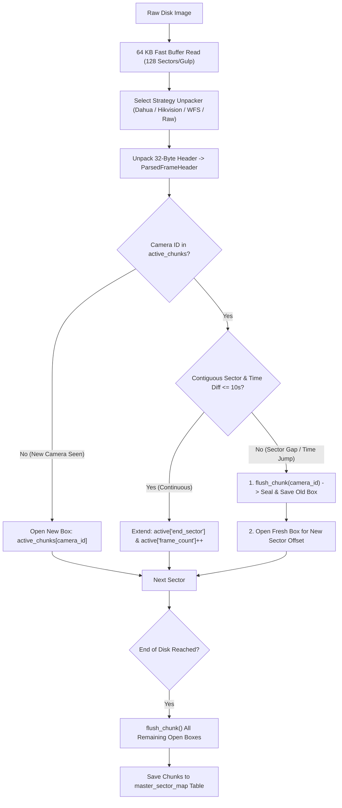

# 🧩 Flow 03: Sector Header Parsing & Master Sector Map

> **Module:** `backend/app/modules/header_parser/`  
> **Status:** `✅ Completed (17/17 Flow 03 Tests Passing, 68/68 Overall)`  
> **Purpose:** Parse proprietary 32-byte frame headers (DHAV, HIKB, WFS, Raw NALs) across disk sectors and generate an aggregated, high-speed `master_sector_map` catalog in SQLite linking camera IDs, timestamps, keyframes, and physical sector boundaries.

---

## 🎯 The Core Problem: The 60-Million-Frame Trap

In a real-world CCTV investigation, a 4-channel DVR recording for just **1 week** generates:

$$\text{4 Cameras} \times \text{25 FPS} \times \text{60s} \times \text{60m} \times \text{24h} \times \text{7d} = \mathbf{60,480,000 \text{ Individual Frames!}}$$

### 💥 Why Storing Frame-by-Frame Fails:
* **Database Ballooning:** Inserting 60 million individual rows expands SQLite to **15–20 Gigabytes** just for table indexes.
* **Disk I/O Bottleneck:** Writing 60M rows takes **25–30 minutes** and freezes the machine.
* **UI Memory Crash:** Fetching millions of points into Google Chrome crashes the browser renderer with an Out-of-Memory error.

### 🚀 The Locus Solution: Contiguous Chunk Aggregation
Instead of individual frames, Locus aggregates continuous streams of frames into **Sector Chunks** (e.g. 15-minute continuous clips per camera):

| Strategy | Total SQLite Rows | Database File Size | Search Query Latency |
| :--- | :---: | :---: | :---: |
| **Frame-by-Frame (Naive)** | `60,480,000` rows 💥 | ~18 GB 🐢 | 5 to 10 seconds |
| **Contiguous Chunk Map (Locus)** | **`2,688` rows** ⚡ | **~250 KB** 🏎️ | **1 millisecond (< 0.001s)** |

---

## 📦 The "Shipping Box" Chunk Aggregation Engine (`indexer.py`)



### 🔍 Key Lifecycle Methods in `indexer.py`:

#### 1. `active_chunks: dict[int, dict]` (Line 60)
Maintains isolated in-memory tracking drafts for each camera channel simultaneously (`active_chunks[1]`, `active_chunks[2]`). Cameras never mix because each camera has its own independent dictionary key.

#### 2. `flush_chunk(cam_id)` — The "Seal & Save" Trigger (Lines 62–78)
1. **`c = active_chunks.pop(cam_id)`:** Pulls the temporary in-progress draft out of RAM.
2. **`size_b = (end_sector - start_sector + 1) * 512`:** Calculates exact physical byte size on disk.
3. **`chunks.append(SectorChunkInfo(...))`:** Creates the immutable chunk record.

**The Two Triggers for `flush_chunk`:**
* **Trigger 1 (Stream Interruption / Gap):** When a camera's sector jumps (e.g. from Sector 4000 to Sector 8000 because another camera was written in between) or timestamps jump by $> 10$ seconds.
* **Trigger 2 (End of Disk):** Flushes all remaining open camera boxes when the scanner reaches the final sector so zero video is lost.

---

## 🔬 Binary Header Specifications & Reverse Engineering

### 1. Dahua Technology & CP PLUS (`DHAV`)
* **Magic Signature:** `b"DHAV"` (`0x44 0x48 0x41 0x56`)
* **Channel ID (Byte 4):** 0-indexed uint8 $\rightarrow$ `camera_id = byte + 1`.
* **Frame Type (Byte 5):** `0xFD` = **I-Frame (Keyframe)**, `0xFC` = **P-Frame (Delta)**.
* **Payload Length (Bytes 8–11):** `struct.unpack("<I", chunk[8:12])[0]` (uint32 Little Endian).
* **Packed 32-Bit Bitfield Timestamp (Bytes 12–15):**
  Dahua packs Date and Time into a single 4-byte integer using bit shifting:

```text
31        26 25    22 21   17 16   12 11     6 5      0
+-----------+--------+-------+-------+--------+-------+
| Year (6b) | Mo (4b)|Day(5b)| Hr(5b)| Min(6b)|Sec(6b)|
+-----------+--------+-------+-------+--------+-------+
   6 bits     4 bits  5 bits  5 bits   6 bits  6 bits  = 32 bits total!
```

$$\text{Year} = (\text{raw\_ts} \gg 26) + 2000$$
$$\text{Month} = (\text{raw\_ts} \gg 22) \& 0x0F$$
$$\text{Day} = (\text{raw\_ts} \gg 17) \& 0x1F$$
$$\text{Hour} = (\text{raw\_ts} \gg 12) \& 0x1F$$
$$\text{Minute} = (\text{raw\_ts} \gg 6) \& 0x3F$$
$$\text{Second} = \text{raw\_ts} \& 0x3F$$

* **Codec Detection (Payload Start):** Inspects the first 5 payload bytes:
  * `0x00 0x00 0x00 0x01 0x40` or `0x42` $\rightarrow$ **H.265 (HEVC / 4K)**
  * `0x00 0x00 0x00 0x01 0x67` $\rightarrow$ **H.264 (AVC)**

---

### 2. Hikvision & EZVIZ (`HIKB` / `HKFS`)
* **Magic Signature:** `b"HIKB"` (`0x48 0x49 0x4B 0x42`)
* **Channel ID (Bytes 4–5):** `struct.unpack("<H", chunk[4:6])[0] + 1` (uint16 Little Endian).
* **Frame Type (Byte 6):** `0x01` = **Keyframe (I-Frame)**, `0x02` = **P-Frame**.
* **Explicit Codec Mapping (Byte 7):**
  * `0x01` $\rightarrow$ `"H264"`
  * `0x02` $\rightarrow$ `"H265"`
  * `0x03` $\rightarrow$ `"MPEG4"` *(Older 2012–2016 Hikvision DVRs)*
  * `0x04` $\rightarrow$ `"MJPEG"` *(Snapshot cameras)*
* **Payload Length (Bytes 8–11):** `struct.unpack("<I", chunk[8:12])[0]`.
* **Timestamp (Bytes 12–15):** Standard 32-bit Unix Epoch timestamp (`datetime.fromtimestamp(ts, tz=UTC)`).

---

### 3. WFS / Swann / Xiongmai (`WFS 0.4`)
* **Magic Signature:** `b"WFS\x00"` or `b"WFS "`
* **Payload Length (Bytes 4–7):** `struct.unpack("<I", chunk[4:8])[0]`.
* **Channel ID (Byte 8):** `byte + 1`.
* **Frame Type (Byte 9):** `0x01` = Keyframe.
* **Timestamp (Bytes 10–13):** Standard 32-bit timestamp.

---

### 4. Universal Raw Stream Fallback
* **NAL Start Codes:** `0x00 0x00 0x00 0x01` or `0x00 0x00 0x01`.
* **H.264 NAL Type:** `nal_byte & 0x1F` (5 = IDR Keyframe, 7 = SPS, 8 = PPS).
* **H.265 NAL Type:** `(nal_byte >> 1) & 0x3F` (19/20 = IDR Keyframe, 32 = VPS, 33 = SPS).

---

## 🗄️ Database Schema: `master_sector_map` Table

```sql
CREATE TABLE master_sector_map (
    id INTEGER PRIMARY KEY AUTOINCREMENT,
    evidence_id VARCHAR(64) NOT NULL REFERENCES evidence_files(id),
    camera_id INTEGER NOT NULL,
    start_sector BIGINT NOT NULL,
    end_sector BIGINT NOT NULL,
    start_time DATETIME NOT NULL,
    end_time DATETIME NOT NULL,
    frame_count INTEGER NOT NULL DEFAULT 0,
    keyframe_count INTEGER NOT NULL DEFAULT 0,
    stream_format VARCHAR(32) NOT NULL DEFAULT 'H264',
    size_bytes BIGINT NOT NULL,
    created_at DATETIME NOT NULL
);
```

---

## 📡 REST API & SSE Endpoints

| Endpoint | Method | Status Code | Description |
| :--- | :--- | :--- | :--- |
| `/api/v1/headers/parse` | `POST` | `202 Accepted` | Starts asynchronous sector header indexing background worker. |
| `/api/v1/headers/results/{evidence_id}` | `GET` | `200 OK` | Retrieves all indexed chunks and per-camera timeline summaries. |
| `/api/v1/headers/stream/{task_id}` | `GET` | `200 OK` (SSE) | Real-time Server-Sent Events stream for sector indexing progress. |

---

## 🧪 Automated Test Verification (17 Flow 03 Tests / 68 Overall)

Verified in `backend/tests/test_header_parser.py` and `backend/tests/test_header_parser_api.py`:

1. `test_dahua_timestamp_bitfield_packing` $\rightarrow$ Validates Dahua bitfield time decoding.
2. `test_dahua_unpacker_iframe_camera1` $\rightarrow$ Validates Dahua Camera 1 I-Frame unpacking.
3. `test_dahua_unpacker_pframe_camera2` $\rightarrow$ Validates Dahua Camera 2 P-Frame unpacking.
4. `test_dahua_unpacker_h265_detection` $\rightarrow$ Validates H.265 VPS prefix detection in Dahua payload.
5. `test_hikvision_unpacker_camera3` $\rightarrow$ Validates Hikvision HIKB Camera 3 unpacking.
6. `test_hikvision_unpacker_mpeg4` $\rightarrow$ Validates Hikvision MPEG-4 codec mapping (`0x03`).
7. `test_wfs_unpacker_camera1` $\rightarrow$ Validates WFS 0.4 16-byte header parsing.
8. `test_raw_stream_unpacker_h264_idr` $\rightarrow$ Validates H.264 IDR NAL unit parsing.
9. `test_raw_stream_unpacker_h265_vps` $\rightarrow$ Validates H.265 VPS NAL unit parsing.
10. `test_master_sector_indexer_dahua_multi_camera` $\rightarrow$ Validates multi-camera chunk aggregation and sector isolation.
11. `test_indexer_missing_file_raises_error` $\rightarrow$ Nonexistent file raises `FileNotFoundError`.
12. `test_header_parser_api_workflow_dahua` $\rightarrow$ Full E2E Dahua async indexing workflow & `AuditLog`.
13. `test_header_parser_reindex_idempotency` $\rightarrow$ Re-indexing replaces old map chunks without primary key collision.
14. `test_header_parser_missing_evidence_returns_404` $\rightarrow$ 404 guard for invalid evidence ID.
15. `test_header_parser_missing_file_on_disk_returns_400` $\rightarrow$ 400 guard for missing disk image.
16. `test_get_master_map_results_unindexed_evidence` $\rightarrow$ Unindexed evidence returns `status: "UNINDEXED"`.
17. `test_stream_headers_missing_task_returns_404` $\rightarrow$ SSE 404 guard for invalid task ID.
