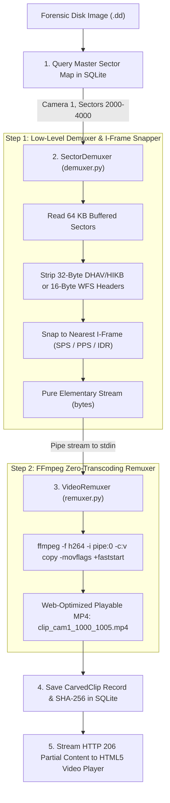

# 🎬 Flow 04: Sector Video Carving & Stream Remuxing (.mp4)

> **Module:** `backend/app/modules/carver/`  
> **Status:** `✅ Completed (12/12 Flow 04 Tests Passing, 80/80 Overall)`  
> **Purpose:** Extract raw proprietary video frame streams from disk sectors, strip vendor envelopes (DHAV, HIKB, WFS), align on Keyframes (I-Frames), and remux into web-playable, court-admissible `.mp4` video files using FFmpeg zero-transcoding (`-c:v copy -movflags +faststart`).

---

## 🎯 The Hybrid 2-Step Architecture

FFmpeg alone cannot parse raw CCTV disk sectors or proprietary 32-byte headers (`Invalid data found when processing input`). Locus uses a **Hybrid 2-Step Architecture**:



---

## 🔬 Core Engineering Innovations

### 1. I-Frame Snap Alignment (`demuxer.py`)
* If a carver cuts a video in the middle of standard P-Frames (delta frames) without starting on an **I-Frame (IDR Slice)**, video players like VLC and Chrome render gray or green artifact blocks.
* `SectorDemuxer` inspects each frame's keyframe flag (`0xFD` for Dahua, `0x01` for Hikvision/WFS, NAL Type 5/19 for raw) and **discards all leading P-frames** until the first valid Keyframe arrives.
* Result: **100% glitch-free instantaneous video playback!**

### 2. Zero-Transcode Remuxing (`-c:v copy`)
* Re-encoding a 15-minute 1080p video clip takes **5 to 10 minutes** of heavy CPU load and alters the original pixel hash.
* **Remuxing (`-c:v copy`)** simply takes the original H.264/H.265 compressed packets and wraps them in an ISO `.mp4` container in **< 0.5 seconds** with **0% CPU transcoding loss** and **100% forensic pixel integrity**.

### 3. FastStart Web Metadata (`-movflags +faststart`)
* Moves the MP4 `moov atom` (video index header) from the end of the file to the very beginning.
* Enables the React frontend HTML5 video player to start playing immediately as bytes stream in, without waiting for the whole 50 MB file to download.

### 4. HTTP 206 Partial Content Video Streaming (`router.py`)
* Implements standard HTTP Byte-Range support (`Range: bytes=1048576-2097151`).
* Allows investigators to scrub back and forth on the timeline with instant seeking and zero buffering lag.

---

## 🗄️ Database Schema: `carved_clips` Table

```sql
CREATE TABLE carved_clips (
    id VARCHAR(64) PRIMARY KEY,              -- clip_a8f3b2c1
    evidence_id VARCHAR(64) NOT NULL REFERENCES evidence_files(id),
    camera_id INTEGER NOT NULL,              -- Camera 1, 2, 3...
    start_time DATETIME NOT NULL,            -- 2026-08-29 10:00:00
    end_time DATETIME NOT NULL,              -- 2026-08-29 10:05:00
    start_sector BIGINT NOT NULL,
    end_sector BIGINT NOT NULL,
    codec VARCHAR(16) NOT NULL,              -- H264, H265, MPEG4
    file_path TEXT NOT NULL,                 -- /data/carved_clips/ev_1/cam1_0_2048_clip_1.mp4
    file_size_bytes BIGINT NOT NULL,
    sha256_hash VARCHAR(64) NOT NULL,        -- Cryptographic integrity proof
    md5_hash VARCHAR(32) NOT NULL,
    frame_count INTEGER NOT NULL DEFAULT 0,
    created_at DATETIME NOT NULL
);
```

---

## 📡 REST API & Streaming Endpoints

| Endpoint | Method | Status Code | Description |
| :--- | :--- | :--- | :--- |
| `/api/v1/carver/clip` | `POST` | `202 Accepted` | Asynchronously carves a specific camera sector range or time window into `.mp4`. |
| `/api/v1/carver/all` | `POST` | `202 Accepted` | Asynchronously batch-carves all chunks in the `master_sector_map` into separate `.mp4` files. |
| `/api/v1/carver/results/{evidence_id}` | `GET` | `200 OK` | Retrieves list of all carved clips with absolute streaming URLs. |
| `/api/v1/carver/stream/{clip_id}` | `GET` | `200 OK` / `206 Partial` | HTTP Range video streamer for HTML5 `<video>` scrub bar. |
| `/api/v1/carver/progress/{task_id}` | `GET` | `200 OK` (SSE) | Real-time Server-Sent Events stream for carving progress. |

---

## 🧪 Automated Test Verification (12 Flow 04 Tests / 80 Overall)

Verified in `backend/tests/test_carver.py` and `backend/tests/test_carver_api.py`:

1. `test_ffmpeg_binary_path_resolution` $\rightarrow$ Resolves binary in `backend/bin/linux/ffmpeg` or system PATH.
2. `test_build_remux_command_h264` $\rightarrow$ Validates H.264 arguments (`-c:v copy -movflags +faststart`).
3. `test_build_remux_command_h265` $\rightarrow$ Validates H.265 / HEVC arguments.
4. `test_sector_demuxer_dahua_stripping` $\rightarrow$ Validates 32-byte DHAV header stripping and payload extraction.
5. `test_sector_demuxer_iframe_snap_drops_leading_pframes` $\rightarrow$ Discards leading P-frames until first I-frame.
6. `test_video_remuxer_h264_to_mp4` $\rightarrow$ Remuxes raw bytes into valid `.mp4` with `ftyp` box and dual hashes.
7. `test_video_remuxer_empty_stream_raises_value_error` $\rightarrow$ Empty byte stream raises `ValueError`.
8. `test_carve_single_clip_api_workflow` $\rightarrow$ E2E single clip carving, SQLite persistence, and `AuditLog`.
9. `test_video_streaming_http_206_range_support` $\rightarrow$ Full download (`200`) and Byte-Range seeking (`206 Partial Content`).
10. `test_carve_all_batch_api_workflow` $\rightarrow$ E2E batch carving of all master map chunks.
11. `test_carve_missing_evidence_returns_404` $\rightarrow$ 404 guard for non-existent evidence.
12. `test_stream_carving_missing_task_returns_404` $\rightarrow$ 404 guard for invalid task ID.
