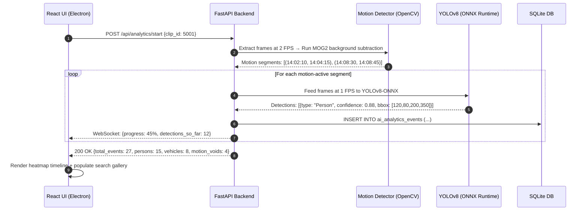

# Feature 06: AI-Assisted Analytics & Motion Detection

**Back to [[MVP/MVP|MVP]]**

---

## What it Does

A standard 16-channel DVR recording over 30 days generates roughly **480 camera-days** of continuous video. If a suspect walked past a camera for exactly 4 seconds, finding that event manually requires an investigator to sit and fast-forward through hours of empty footage — staring at an empty parking lot at 3 AM.

**AI Analytics** solves this by automatically scanning the carved video in the background, detecting motion events and specific objects (persons, vehicles), and writing their exact timestamps to a searchable index inside SQLite. This transforms hours of raw footage into a Google-like searchable database.

The investigator never needs to "watch" the video to find evidence. They **search** it.

---

## Why This Feature is Critical

- **Time savings:** 30 days × 16 cameras = 480 days of footage. No human can manually review this. The AI scans it in hours, not weeks.
- **Precision:** The AI detects events the human eye might miss during fatigued fast-forwarding sessions.
- **Offline privacy:** Since this is criminal evidence, we **cannot** send frames to cloud APIs (OpenAI, Google Cloud Vision, AWS Rekognition). All processing runs locally on the investigator's machine.

---

## Key Concepts Explained

### The 1,000-Page Book Analogy
Imagine you are given a 1,000-page book and told: *"Find every time the word 'Red Car' is mentioned."* If you read every page manually, it will take hours. But if the book has an **Index** at the back, you just look up "Red Car," see it appears on pages 45, 102, and 890, and flip directly there.

**That is exactly what this feature builds.** The AI reads every "page" (video frame) at high speed, and writes an "Index" (SQLite table) listing every interesting event and its exact timestamp. The investigator just looks up the index.

### What is ONNX Runtime?
ONNX (Open Neural Network Exchange) is a standard format for AI models. Instead of requiring the investigator's machine to install heavy frameworks like PyTorch (3+ GB), we ship a tiny, pre-exported `.onnx` model file (~6 MB for YOLOv8-nano) that runs on any CPU. If the machine has an NVIDIA GPU, ONNX Runtime automatically uses it for 10x speed.

### What is YOLOv8?
YOLO (You Only Look Once) is the world's most popular real-time object detection model. Given a single video frame, it identifies all visible objects (Person, Car, Truck, Motorcycle, Backpack, etc.), draws bounding boxes around them, and assigns a confidence score (e.g., "Person: 88% sure").

### What is Background Subtraction (Motion Detection)?
Before running heavy AI detection, we first use a simple, fast algorithm to find which parts of the video have any motion at all. The algorithm compares consecutive frames and says: "These pixels changed = motion; these pixels are identical = nothing happening." This lets us skip hours of dead time (like an empty hallway at night) and only run the expensive AI on segments where something actually moved.

---

## The Two-Stage Analytics Pipeline

### Stage A: Motion Void Detection (Fast Filter)
**Goal:** Quickly identify which time segments have zero activity, so the AI doesn't waste time analyzing empty footage.

1. Extract frames at a low sample rate (2 frames per second — fast and lightweight).
2. Apply background subtraction (MOG2 algorithm) to detect pixel-level changes between consecutive frames.
3. If no significant motion is detected over a time span, mark that segment as a **Motion Void** (dead time).
4. **Result:** Hours of empty footage are tagged as "skip zones," reducing the AI workload by 60–90%.

### Stage B: Object Detection (YOLOv8 / ONNX)
**Goal:** For time segments where motion *was* detected, identify exactly what moved.

1. Extract frames at a higher sample rate (1 frame per second) from motion-active segments only.
2. Feed each frame into the YOLOv8-ONNX model running locally on the investigator's CPU/GPU.
3. The model returns bounding boxes and labels: `Person (88%)`, `Car (92%)`, `Backpack (71%)`.
4. Write each detection as a timestamped event record into SQLite.

---

## Component Responsibility & Architecture

- **FastAPI Engine (Python Layer):** Manages the background analytics worker queue. Accepts carved clip paths, spawns analysis workers, and streams progress updates via WebSocket.
- **Motion Detector (OpenCV MOG2):** Lightweight frame differencing to identify motion voids vs active segments.
- **ONNX Runtime Engine:** Executes the quantized YOLOv8-nano model locally. Supports CPU, CUDA (NVIDIA GPU), and DirectML (AMD GPU) execution providers.
- **SQLite Database:** Writes detection events into `ai_analytics_events` table with timestamps, confidence scores, and optional thumbnail blobs.
- **React UI (Electron):** Renders heatmap markers on the master timeline and a searchable event gallery panel.

---

## SQLite Database Schema (`ai_analytics_events`)

| Column Name | Data Type | Sample Value | Purpose |
| :--- | :--- | :--- | :--- |
| `event_id` | `INTEGER` (PK) | `8001` | Unique event ID |
| `channel_id` | `INTEGER` (FK) | `2` | Camera channel |
| `start_timestamp` | `INTEGER` | `1718901234` | When the event started |
| `end_timestamp` | `INTEGER` | `1718901240` | When the event ended |
| `event_type` | `TEXT` | `"PERSON"` | Detection class (`MOTION`, `PERSON`, `VEHICLE`) |
| `confidence` | `REAL` | `0.88` | Model confidence score (0.0 to 1.0) |
| `bounding_box` | `TEXT` | `"[120, 80, 200, 350]"` | JSON array: [x, y, width, height] in pixels |
| `thumbnail_blob` | `BLOB` | `(binary JPEG)` | Optional: tiny cropped JPEG of the detection |

---

## What the Investigator Actually Sees (The UI Experience)

### 1. The Heatmap Timeline
The playback timeline at the bottom of the screen is **color-coded** with tick marks:
- **Red ticks** = Person detected
- **Blue ticks** = Vehicle detected
- **Grey zones** = Motion voids (nothing happening)

### 2. The "Skip Empty Time" Toggle
A single toggle button that, when enabled, automatically fast-forwards through Motion Void segments. The video only plays during moments of activity.

### 3. The Search Gallery
A sidebar panel with a search bar and filter controls:
- The investigator selects **"Show: Persons"** and **"Confidence: > 80%"**.
- A gallery of thumbnail images appears, each showing a cropped detection with its timestamp.
- Clicking a thumbnail **instantly** seeks the master video playhead to that exact frame.

---

## Step-by-Step Data Flow Pipeline

```text
1. Analytics Trigger ──────────► After carving completes, auto-queue clips for analysis
                                           │
                                           ▼
2. Motion Void Scan ───────────► Extract 2 FPS → MOG2 background subtraction
                                           │
                                           ▼
3. Active Segment Tagging ─────► Mark time ranges with motion vs no motion
                                           │
                                           ▼
4. YOLOv8 Object Detection ───► Feed active segments (1 FPS) through ONNX Runtime
                                           │
                                           ▼
5. Event Emission ─────────────► Each detection → INSERT into `ai_analytics_events`
                                           │
                                           ▼
6. WebSocket Progress Update ──► Stream live progress + detection count to React UI
                                           │
                                           ▼
7. Timeline Heatmap Render ────► React draws colored tick marks on the master timeline
                                           │
                                           ▼
8. Search Gallery Population ──► Thumbnails populate the searchable event sidebar
```

---

## Sequence Diagram



---

## Technical Specifications & APIs

- **Folder Location:** `Projects/locus/MVP/features/ai-analytics/`
- **Python Module:** `app.analytics.detector`
- **ONNX Model:** `models/yolov8n.onnx` (~6 MB, quantized INT8)
- **FastAPI Endpoints:**
  - `POST /api/analytics/start` — Start background analysis on a carved clip
  - `GET /api/analytics/events?channel_id=2&type=PERSON&min_confidence=0.8` — Query detection events
- **Sample Events Query Response:**
  ```json
  {
    "total_events": 15,
    "events": [
      {
        "event_id": 8001,
        "channel_id": 2,
        "start_timestamp": 1718901234,
        "event_type": "PERSON",
        "confidence": 0.88,
        "bounding_box": [120, 80, 200, 350]
      }
    ]
  }
  ```
