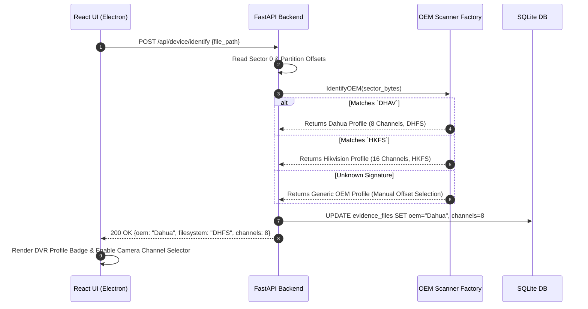

# Feature 02: Device & File System Identification

**Back to [[MVP/MVP|MVP]]**

---

## What it Does

Once the disk image is safely loaded and write-block protected, Locus needs to determine t looks for an orpwhich company manufactured the DVR/NVR (e.g., Dahua, Hikvision, CP Plus) and how its custom file system is formatted.

Locus automatically scans the initial physical sectors of the `.dd` file searching for hidden manufacturer "magic byte signatures" (like `DHAV` for Dahua or `HKFS` for Hikvision). It rapidly identifies the manufacturer, partition boundaries, and camera channel count (e.g., 8 channels vs 16 channels), displaying the detected DVR profile on the UI so the correct carving engine is selected automatically.

---

## Component Responsibility & Architecture

- **FastAPI Engine (Python Layer):** Reads Sector 0, Sector 1, and partition offsets; runs signature matching algorithms using the `Factory Strategy Pattern` (`DeviceIdentifierFactory`).
- **OEM Scanner Registry:** Instantiates specific OEM scanners (`DahuaScanner`, `HikvisionScanner`, `CPPlusScanner`).
- **React UI (Electron):** Renders the detected DVR Profile Card (OEM logo, model name, channel count, filesystem format).
- **SQLite Database:** Updates the `evidence_files` record with the detected OEM metadata.

---

## SQLite Database Schema Updates (`evidence_files`)

| Column Name     | Data Type | Sample Value         | Purpose                            |
| :-------------- | :-------- | :------------------- | :--------------------------------- |
| `oem_name`      | `TEXT`    | `"Dahua Technology"` | Identified manufacturer            |
| `filesystem`    | `TEXT`    | `"DHFS v2.1"`        | Proprietary filesystem format      |
| `channel_count` | `INTEGER` | `8`                  | Number of recorded camera channels |
| `sector_size`   | `INTEGER` | `512`                | Sector block size in bytes         |
| `confidence`    | `REAL`    | `0.99`               | Identification confidence score    |

---

## Step-by-Step Data Flow Pipeline

```text
1. Automatic Ingestion Event ──► Triggers `POST /api/device/identify`
                                           │
                                           ▼
2. Python Sector Reader ────────► Reads Sector 0, 1, and partition table offsets
                                           │
                                           ▼
3. Signature Matching Engine ───► Compares raw bytes against OEM magic registry (`DHAV`, `HKFS`, etc.)
                                           │
                                           ▼
4. Metadata Extractor ──────────► Unpacks channel count, DVR serial string, and sector size
                                           │
                                           ▼
5. SQLite Database Update ──────► Stores OEM profile metadata in `evidence_files`
                                           │
                                           ▼
6. React Dashboard Update ──────► Renders detected DVR profile card with channel grid buttons
```

---

## Sequence Diagram



---

## Technical Specifications & APIs

- **Folder Location:** `Projects/locus/MVP/features/device-identification/`
- **Python Module:** `app.carving.scanners.device_id`
- **FastAPI Endpoint:** `POST /api/device/identify`
- **Sample Request Payload:**
  ```json
  {
    "file_path": "/storage/evidence/dvr_dahua_500mb.dd"
  }
  ```
- **Sample Response Payload:**
  ```json
  {
    "status": "identified",
    "oem": "Dahua Technology",
    "filesystem": "DHFS v2.1",
    "channels": 8,
    "confidence": 0.99,
    "sector_size": 512,
    "magic_bytes_hex": "44484156"
  }
  ```
