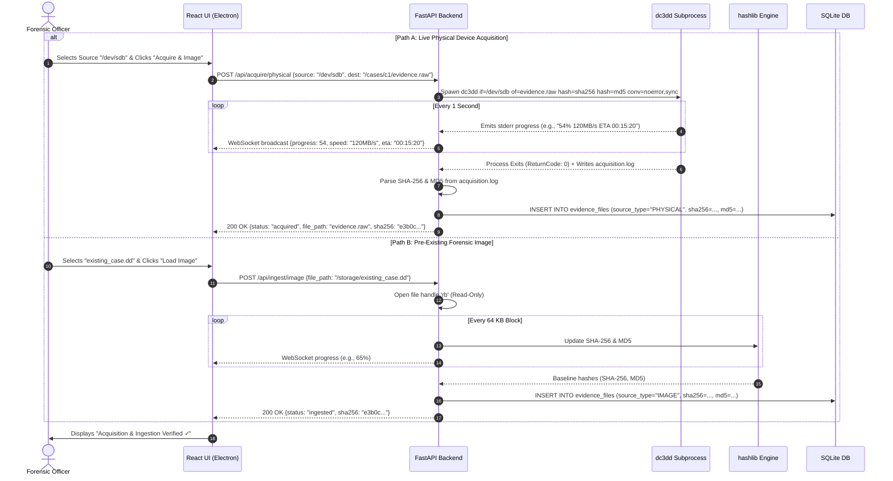

# Feature 01: Physical Acquisition & Case Ingestion

**Back to [[MVP/MVP|MVP]]**

---

## What it Does

When a forensic officer starts a new case, they have physical evidence that needs to be brought into Locus. Locus supports **two distinct intake modalities**:

1. **Path A: Live Physical Disk Acquisition (The `dc3dd` Engine)**
   The investigator connects a seized raw physical DVR hard drive (e.g., `/dev/sdb` on Linux or `\\.\PhysicalDrive1` on Windows) via a hardware write-blocker. Locus runs an embedded open-source acquisition engine (**`dc3dd`**) to clone the physical drive sector-by-sector into a raw bit-stream `.raw` or `.dd` forensic image, calculating dual cryptographic hashes on-the-fly.

2. **Path B: Pre-Existing Forensic Image Ingestion**
   If a forensic image has already been created (e.g., received as a `.dd` or `.raw` file on a thumb drive), the investigator simply browses and selects the file. Locus locks the file in **strict Read-Only mode** and streams the bytes through dual hash algorithms to freeze the baseline state.

---

## The Open-Source Acquisition Engine (`dc3dd`)

For live physical disk cloning, Locus integrates **`dc3dd`** (Department of Defense Computer Forensics Lab version of `dd`) as an automated background subprocess.

### The Exact `dc3dd` Command Pipeline:
```bash
dc3dd if=/dev/sdb \
      of=/cases/CASE_001/evidence.raw \
      hash=sha256 \
      hash=md5 \
      log=/cases/CASE_001/acquisition.log \
      errlog=/cases/CASE_001/bad_sectors.log \
      status=on \
      statusinterval=1 \
      conv=noerror,sync
```

### Why `dc3dd` is Critical for Forensic Video:
- **`conv=noerror,sync` (Bad Sector Defense):** Surveillance DVR hard drives often suffer from physical wear or damaged sectors. Standard `dd` crashes upon encountering a bad sector. `dc3dd` skips the unreadable sector without crashing and pads it with null bytes (`0x00`), preserving the exact sector alignment so subsequent video carving is not thrown out of phase.
- **On-the-Fly Dual Hashing (`hash=sha256 hash=md5`):** Calculates both SHA-256 and MD5 hashes simultaneously while copying bytes across the bus, eliminating the need for a separate slow post-hashing pass.
- **Real-Time Telemetry (`status=on statusinterval=1`):** Emits throughput (MB/s), bytes copied, and ETA every second to `stderr`, which Locus regex-parses and streams to the React UI progress bar.
- **Immutable Log Generation (`log=... errlog=...`):** Generates an audit-ready acquisition log file and records the exact sector addresses of any unreadable/bad sectors for courtroom transparency.

---

## Why Cryptographic Hashes Are Legally Required

### 1. The Avalanche Effect (Mathematical Proof)
Changing even **a single bit (0 to 1) or a single pixel in one video frame** causes over 50% of the output hash string to change completely. This mathematically proves evidence authenticity.

### 2. Why Dual Hashing (SHA-256 & MD5)?
- **SHA-256:** The modern, collision-resistant 64-character forensic security standard.
- **MD5:** 32-character legacy algorithm used for backward compatibility with legacy police evidence tags and older hardware write-blockers.

### 3. Why Re-Checking Hashes is Necessary
While Locus enforces read-only access, hashes are re-checked at export to protect against:
- External OS tampering or accidental modification outside Locus.
- Physical storage degradation (Bit-Rot).
- Proving in court (ISO 27037 & Indian Evidence Act / BSA 2023) that the evidence remained 100% untampered throughout the analysis.

---

## Component Responsibility & Architecture

- **React / Electron Shell (UI Layer):** 
  - Allows investigator to toggle between "Physical Drive Acquisition" and "Existing Image Ingestion".
  - For Path A: Detects and displays available physical block devices (`/dev/sdX`).
  - For Path B: Triggers native file picker (`dialog.showOpenDialog`).
  - Renders real-time progress bar, transfer speed (MB/s), elapsed time, and ETA via WebSockets.
- **FastAPI Engine (Python Layer):** 
  - **Path A:** Spawns `dc3dd` via `asyncio.create_subprocess_exec`, monitors `stderr` line-by-line, parses regex progress metrics, and broadcasts to WebSocket clients.
  - **Path B:** Opens file handle with strict read-only flags (`open(path, 'rb')`), streams 64 KB chunks into Python `hashlib`.
- **SQLite Database (Storage Layer):** 
  - Stores case details, physical drive metadata, output `.raw` file path, baseline SHA-256/MD5 hashes in `evidence_files` table, and logs initial acquisition in `audit_trail`.

---

## SQLite Database Schema (`evidence_files`)

| Column Name | Data Type | Sample Value | Purpose |
| :--- | :--- | :--- | :--- |
| `id` | `TEXT` (PK) | `"ev_101"` | Unique evidence record ID |
| `case_id` | `TEXT` (FK) | `"case_001"` | Associated investigation case |
| `source_type` | `TEXT` | `"PHYSICAL_DEVICE"` | `"PHYSICAL_DEVICE"` or `"IMAGE_FILE"` |
| `source_device` | `TEXT` | `"/dev/sdb"` | Original source block device or path |
| `file_path` | `TEXT` | `"/cases/CASE_001/evidence.raw"` | Absolute path to disk image |
| `file_size_bytes` | `INTEGER` | `1000204886016` | Exact file size in bytes (1 TB) |
| `sha256_hash` | `TEXT` | `"e3b0c44298fc1c149afbf4c8..."` | Master baseline SHA-256 fingerprint |
| `md5_hash` | `TEXT` | `"d41d8cd98f00b204e9800998ecf8427e"` | Secondary baseline MD5 fingerprint |
| `bad_sectors_count`| `INTEGER` | `0` | Count of padded bad sectors |
| `acquisition_log` | `TEXT` | `"/cases/CASE_001/acquisition.log"` | Path to dc3dd audit log |
| `write_block` | `BOOLEAN` | `TRUE` | Proves write-block protection |
| `created_at` | `DATETIME` | `"2026-08-25T15:15:00Z"` | Ingestion timestamp |

---

## Step-by-Step Data Flow Pipeline

```text
                 ┌──────────────────────────────────────────────┐
                 │ Investigator Selects Intake Modality in UI   │
                 └──────────────────────┬───────────────────────┘
                                        │
             ┌──────────────────────────┴──────────────────────────┐
             ▼                                                     ▼
   [ PATH A: Physical Drive ]                           [ PATH B: Existing Image ]
             │                                                     │
   Selects `/dev/sdb` & output path                     Selects `existing_case.dd`
             │                                                     │
   FastAPI spawns `dc3dd` subprocess                    FastAPI opens `open(path, 'rb')`
   with `conv=noerror,sync` & dual hashing              in strict Read-Only mode
             │                                                     │
   Streams stdout/stderr regex progress                 Streams 64KB blocks through
   via WebSocket (MB/s, %, ETA)                         `hashlib.sha256()` & `md5()`
             │                                                     │
   `dc3dd` exits 0 → parses .log file                   Calculates baseline hashes
             │                                                     │
             └──────────────────────────┬──────────────────────────┘
                                        ▼
                 ┌──────────────────────────────────────────────┐
                 │ Writes Baseline Hashes to SQLite DB          │
                 │ (`evidence_files` & `audit_trail`)           │
                 └──────────────────────┬───────────────────────┘
                                        │
                                        ▼
                 ┌──────────────────────────────────────────────┐
                 │ UI shows "Write-Block Active & Verified"     │
                 │ Automatically hands off to Step 02 (Device ID)│
                 └──────────────────────────────────────────────┘
```

---

## Sequence Diagram



---

## Technical Specifications & APIs

- **Folder Location:** `Projects/locus/MVP/features/disk-imaging/`
	- **Python Module:** `app.carving.acquisition`
	- **FastAPI Endpoints:**
	  - `POST /api/acquire/physical` — Start live physical disk acquisition via `dc3dd`
	  - `POST /api/ingest/image` — Ingest pre-existing `.dd`/`.raw` image
	  - `GET /api/devices/list` — List available physical block devices for selection
	- **Sample Physical Acquisition Request Payload:**
	  ```json
  {
    "case_id": "case_101",
    "investigator_name": "Officer Sharma",
    "source_device": "/dev/sdb",
    "destination_path": "/cases/CASE_101/evidence.raw",
    "enable_dual_hash": true
  }
  ```
- **Sample Physical Acquisition Response Payload:**
  ```json
  {
    "status": "completed",
    "case_id": "case_101",
    "output_file": "/cases/CASE_101/evidence.raw",
    "size_bytes": 1000204886016,
    "sha256": "e3b0c44298fc1c149afbf4c8996fb92427ae41e4649b934ca495991b7852b855",
    "md5": "d41d8cd98f00b204e9800998ecf8427e",
    "bad_sectors_padded": 0,
    "log_file": "/cases/CASE_101/acquisition.log",
    "write_block_verified": true
  }
  ```

---

## Plain English Summary

**The Clone & Fingerprint Analogy:** 
Imagine you are handed an ancient, fragile diary from a crime scene. You cannot write notes inside it or risk tearing a page. 
- **Physical Acquisition (`dc3dd`):** You place the diary into a specialized high-speed photocopier that makes a flawless, page-for-page replica. If one page has a smudge or tear (`bad sector`), the machine carefully inserts a clean blank placeholder (`conv=noerror,sync`) instead of jamming and tearing the whole book.
- **Hashing:** As each page is scanned, the machine takes a microscopic digital fingerprint of the ink. If anyone in the future claims a page was altered, the fingerprints prove beyond all doubt that our digital copy is 100% faithful to the original.
