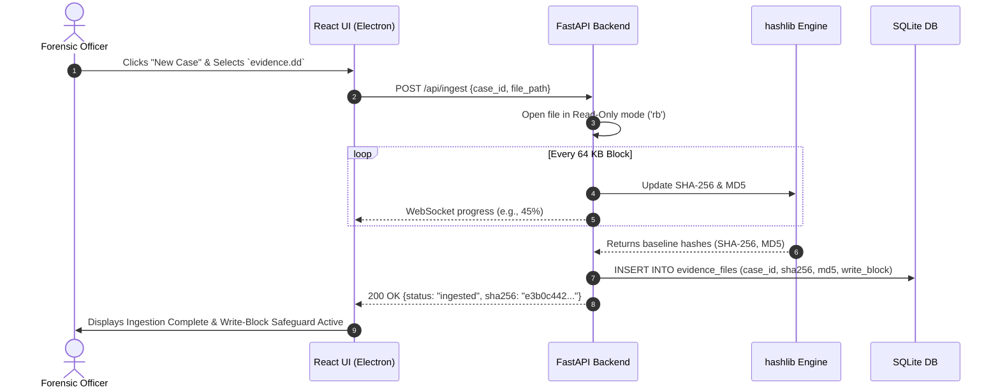

# Feature 01: Case Intake & Disk Acquisition

**Back to [[Projects/locus/MVP/MVP|MVP]]**

---

## What it Does

When a forensic officer receives a seized DVR hard drive or its digital bit-stream copy (`.dd` or `.raw` file), they launch Locus to begin a new investigation. 

Locus opens a native desktop file picker to select the image file. To comply with legal evidence standards, Locus opens the disk image in **strict Read-Only mode** (software write-block protection), guaranteeing that not a single bit of source evidence can ever be altered or corrupted. 

As the file is loaded, Locus streams the raw byte data through dual cryptographic hash algorithms (`SHA-256` and `MD5`) to generate a unique digital fingerprint. This baseline hash is saved to freeze the evidence state in time, and a green *"Write-Block Safeguard Active"* badge is displayed on the investigator's screen.

---

## Why Cryptographic Hashes Are Legally Required

### 1. The Avalanche Effect (Mathematical Proof)
Changing even **a single bit (0 to 1) or a single pixel in one video frame** causes over 50% of the output hash string to change completely. This mathematically proves evidence authenticity.

### 2. Why Dual Hashing (SHA-256 & MD5)?
- **SHA-256:** The modern, unhackable 64-character security standard.
- **MD5:** Older 32-character algorithm used for backward compatibility with legacy police physical evidence tags & hardware write-blockers.

### 3. Why Re-Checking Hashes is Necessary
While Locus opens files in read-only mode, hashes are re-checked at export to protect against:
- External OS tampering or accidental user modification outside Locus.
- Physical hard drive degradation (Bit-Rot).
- Proving in court (ISO 27037 & Section 65B) that evidence remained 100% untampered throughout the entire trial period.

---

## Component Responsibility & Architecture

- **Electron Shell (UI Layer):** Triggers native OS file picker (`dialog.showOpenDialog`), passes file path to backend, and displays live hash calculation progress.
- **FastAPI Engine (Python Layer):** Receives file path, opens read-only file handle (`open(filepath, 'rb')`), streams 64 KB blocks into Python `hashlib`, and broadcasts live percentage updates via WebSockets.
- **SQLite Database (Storage Layer):** Saves case details, file metadata, baseline SHA-256/MD5 hashes in `evidence_files` table, and creates an immutable initial log in `audit_trail`.

---

## SQLite Database Schema (`evidence_files`)

| Column Name | Data Type | Sample Value | Purpose |
| :--- | :--- | :--- | :--- |
| `id` | `TEXT` (PK) | `"ev_101"` | Unique evidence record ID |
| `case_id` | `TEXT` (FK) | `"case_001"` | Associated investigation case |
| `file_path` | `TEXT` | `"/storage/evidence/dvr_sample.dd"` | Absolute OS path of disk image |
| `file_size_bytes` | `INTEGER` | `524288000` | Exact file size in bytes (500 MB) |
| `sha256_hash` | `TEXT` | `"e3b0c44298fc1c149afbf4c8..."` | Master baseline SHA-256 fingerprint |
| `md5_hash` | `TEXT` | `"d41d8cd98f00b204e9800998ecf8427e"` | Secondary baseline MD5 fingerprint |
| `write_block` | `BOOLEAN` | `TRUE` | Proves file handle was opened read-only |
| `created_at` | `DATETIME` | `"2026-08-23T15:15:00Z"` | Ingestion timestamp |

---

## Step-by-Step Data Flow Pipeline

```text
1. Investigator clicks "New Case" ──► Inputs Case Name & selects `evidence.dd`
                                              │
                                              ▼
2. React UI sends POST request ─────► `POST /api/ingest` payload to FastAPI
                                              │
                                              ▼
3. Python Backend ──────────────────► Opens file handle `open(path, 'rb')` (Read-Only)
                                              │
                                              ▼
4. Chunked Hashing Pipeline ────────► Streams 64 KB blocks through `SHA-256` & `MD5`
                                              │
                                              ▼
5. WebSocket Progress Update ───────► Sends live `%` complete events to React UI
                                              │
                                              ▼
6. SQLite Database Record ──────────► Saves baseline hashes in `evidence_files` table
                                              │
                                              ▼
7. React Dashboard Update ──────────► Renders green "Write-Block Safeguard Active" card
```

---

## Sequence Diagram



---

## Technical Specifications & APIs

- **Folder Location:** `Projects/locus/MVP/features/disk-imaging/`
- **Python Module:** `app.carving.acquisition`
- **FastAPI Endpoint:** `POST /api/ingest`
- **Sample Request Payload:**
  ```json
  {
    "case_id": "case_101",
    "investigator_name": "Officer Sharma",
    "file_path": "/storage/evidence/dvr_dahua_500mb.dd"
  }
  ```
- **Sample Response Payload:**
  ```json
  {
    "status": "ingested",
    "case_id": "case_101",
    "file_path": "/storage/evidence/dvr_dahua_500mb.dd",
    "size_bytes": 524288000,
    "sha256": "e3b0c44298fc1c149afbf4c8996fb92427ae41e4649b934ca495991b7852b855",
    "md5": "d41d8cd98f00b204e9800998ecf8427e",
    "write_block_active": true
  }
  ```
