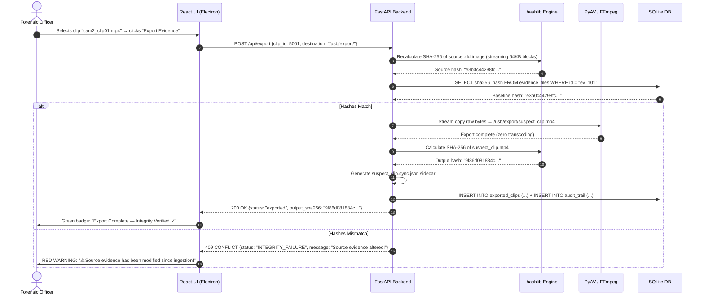

# Feature 08: Hash Verification & Integrity Export

**Back to [[MVP/MVP|MVP]]**

---

## What it Does

After the investigator has found the suspect on video (using AI Analytics and Evidence Search), they need to export that specific video clip to a USB drive, email it to the prosecutor, or present it to the judge. 

But this is criminal evidence. The moment a video leaves the Locus application, a defense attorney will challenge it: *"How do we know this video wasn't faked? How do we know this software didn't alter the footage?"*

**Hash Verification & Integrity Export** solves this by:
1. Exporting the video clip using **zero-transcoding** (raw byte copy, no pixel changes).
2. Calculating a mathematical fingerprint (SHA-256 hash) of the exported file.
3. Generating a cryptographic **Audit Trail Sidecar** (a `.json` receipt + optional `.pdf`) that permanently links the exported clip back to the original seized hard drive.
4. Re-verifying the source drive hash to prove the original evidence hasn't been tampered with since the day it was seized.

---

## Why This Feature is Critical

- **Court admissibility:** Under Indian Evidence Act Section 65B and ISO 27037, digital evidence must have a provable chain of custody. Without cryptographic verification, the evidence can be challenged and thrown out.
- **Tamper detection:** If even a single bit of the exported video is changed (intentionally or accidentally), the SHA-256 hash will be completely different, instantly exposing tampering.
- **Trust:** The judge doesn't need to trust the software or the investigator. They only need to trust mathematics — the hash either matches or it doesn't.

---

## Key Concepts Explained

### The Bloody Knife Analogy (Physical Chain of Custody)
Imagine a detective finds a bloody knife at a crime scene. They put it in an evidence bag and sign their name across the tape seal. They hand it to the crime lab, and the lab tech signs the seal. In court, the judge sees all the unbroken seals and signatures — proving nobody swapped the knife for a fake one.

### The ATM Receipt Analogy (Digital Chain of Custody)
In our case, the "bloody knife" is the 1-Terabyte DVR hard drive. But in court, we're showing a 5-minute video clip — a *new* file that didn't exist before.

Locus acts like a hyper-secure ATM and prints a **Digital Receipt** that travels everywhere with the video:
> *"I started with the original hard drive (fingerprint: ABC...). I went to Sector 5,000 and copied the raw data. I did NOT change a single pixel. I put those bytes into a new file (fingerprint: XYZ...). Officer Smith authorized this extraction on August 24, 2026."*

When the defense challenges the video, anyone can run their own hash on the `.mp4` file. If it still equals `XYZ...`, it proves mathematically that the video is authentic.

### What is Zero-Transcoding Export?
When Locus exports a video clip, it does **not** decode and re-encode the video (which would change the pixel data and break the hash chain). Instead, it uses FFmpeg **stream copy** mode (`-c:v copy`) to lift the exact compressed bytes from the disk and place them into an `.mp4` container. The video data is bit-for-bit identical to what the DVR originally wrote.

### What is the Avalanche Effect?
Changing even a single bit (0 → 1) in a video file causes over **50% of the SHA-256 hash characters to change completely**. This makes it mathematically impossible to tamper with the evidence without being detected.

---

## Component Responsibility & Architecture

- **FastAPI Engine (Python Layer):** Orchestrates the export workflow: re-verifies source hash, performs stream copy export via PyAV, calculates output hash, generates audit sidecar, and logs everything to `audit_trail`.
- **PyAV / FFmpeg (Export Engine):** Stream copy mode remuxing — zero transcoding, zero pixel modification.
- **Python hashlib:** SHA-256 and MD5 calculation for both source verification and output fingerprinting.
- **SQLite Database:** Reads from `evidence_files` (source hash), writes to `exported_clips` and `audit_trail`.
- **React UI (Electron):** Export dialog with clip selection, destination picker, and a visual integrity verification dashboard showing green checkmarks or red warnings.

---

## The Integrity Verification Chain

When the investigator clicks "Export," Locus runs a **three-stage integrity check:**

```text
Stage 1: SOURCE VERIFICATION
  └─► Recalculate SHA-256 of the original .dd disk image
  └─► Compare against the baseline hash stored during ingestion (Feature 01)
  └─► If mismatch → ABORT export + display RED WARNING
       "⚠ Source evidence has been altered since ingestion!"

Stage 2: ZERO-TRANSCODING EXPORT
  └─► Stream copy the selected raw bytes into a new .mp4 container
  └─► No decoding, no re-encoding, no pixel modification

Stage 3: OUTPUT FINGERPRINTING
  └─► Calculate SHA-256 of the newly created .mp4 file
  └─► Generate the Audit Trail Sidecar (.json + .pdf)
  └─► Log everything to the `audit_trail` table
```

---

## The Audit Trail Sidecar

Every exported clip is accompanied by a forensic receipt file that permanently documents its provenance.

### Example: `suspect_clip.sync.json`
```json
{
  "export_metadata": {
    "locus_version": "1.0.0",
    "export_timestamp_utc": "2026-08-25T14:30:00Z",
    "case_number": "CR-2026-8942",
    "investigator_id": "Officer Smith (Badge: 1042)",
    "export_reason": "Suspect identified on Camera 2"
  },
  "source_evidence": {
    "source_type": "Forensic Disk Image (.dd)",
    "source_file": "dvr_dahua_500mb.dd",
    "source_sha256": "e3b0c44298fc1c149afbf4c8996fb924...",
    "source_md5": "d41d8cd98f00b204e9800998ecf8427e",
    "source_verified_at": "2026-08-25T14:29:55Z",
    "source_integrity": "VERIFIED — matches ingestion baseline"
  },
  "extraction_parameters": {
    "channel_id": 2,
    "channel_name": "Front Door Camera",
    "start_sector": 1450204,
    "end_sector": 1461900,
    "start_timestamp_raw": 1718901234,
    "end_timestamp_raw": 1718901534,
    "gop_aligned": true,
    "transcoding": "NONE — stream copy only"
  },
  "calibration_applied": {
    "time_offset_ms": -310000,
    "drift_rate_ppm": 0.0,
    "calibration_method": "OSD_VISUAL",
    "calibrated_by": "Officer Smith"
  },
  "output_evidence": {
    "filename": "suspect_clip.mp4",
    "file_size_bytes": 15728640,
    "duration_seconds": 300.0,
    "frame_count": 7500,
    "output_sha256": "9f86d081884c7d659a2feaa0c55ad015...",
    "output_md5": "a1b2c3d4e5f6a7b8c9d0e1f2a3b4c5d6"
  }
}
```

---

## SQLite Database Schemas

### `exported_clips`

| Column Name | Data Type | Sample Value | Purpose |
| :--- | :--- | :--- | :--- |
| `export_id` | `INTEGER` (PK) | `9001` | Unique export record ID |
| `clip_id` | `INTEGER` (FK) | `5001` | Source carved clip ID |
| `case_number` | `TEXT` | `"CR-2026-8942"` | Case reference |
| `output_path` | `TEXT` | `"/exports/suspect_clip.mp4"` | Path to exported file |
| `output_sha256` | `TEXT` | `"9f86d081884c..."` | SHA-256 of exported file |
| `output_md5` | `TEXT` | `"a1b2c3d4..."` | MD5 of exported file |
| `source_verified` | `BOOLEAN` | `TRUE` | Source hash matched baseline |
| `sidecar_path` | `TEXT` | `"/exports/suspect_clip.sync.json"` | Path to audit sidecar |
| `exported_by` | `TEXT` | `"Officer Smith"` | Who exported |
| `exported_at` | `DATETIME` | `"2026-08-25T14:30:00Z"` | When exported |

### `audit_trail`

| Column Name | Data Type | Sample Value | Purpose |
| :--- | :--- | :--- | :--- |
| `log_id` | `INTEGER` (PK) | `1` | Unique log entry |
| `action` | `TEXT` | `"EXPORT_CLIP"` | Action performed |
| `actor` | `TEXT` | `"Officer Smith"` | Who did it |
| `timestamp` | `DATETIME` | `"2026-08-25T14:30:00Z"` | When |
| `details` | `TEXT` | `"Exported cam2 clip, hash 9f86..."` | Description |
| `integrity_status` | `TEXT` | `"VERIFIED"` | Source integrity at time of action |

---

## Step-by-Step Data Flow Pipeline

```text
1. Export Request ──────────────► Investigator selects clip + clicks "Export Evidence"
                                           │
                                           ▼
2. Source Integrity Check ─────► Recalculate SHA-256 of source .dd image
                                           │
                                           ▼
3. Baseline Comparison ────────► Compare against ingestion hash in `evidence_files`
                                           │
                                       ┌───┴───┐
                                    MATCH?   MISMATCH?
                                       │         │
                                       ▼         ▼
4a. Stream Copy Export ────────►  Export    ABORT + RED
    (zero transcoding)            proceeds    WARNING
                                       │
                                       ▼
5. Output Hash Calculation ────► SHA-256 + MD5 of the new .mp4 file
                                           │
                                           ▼
6. Sidecar Generation ─────────► Generate `suspect_clip.sync.json` + optional `.pdf`
                                           │
                                           ▼
7. SQLite Logging ─────────────► INSERT into `exported_clips` + `audit_trail`
                                           │
                                           ▼
8. UI Confirmation ────────────► Green badge: "Export Complete — Integrity Verified ✓"
```

---

## Sequence Diagram



---

## Technical Specifications & APIs

- **Folder Location:** `Projects/locus/MVP/features/evidence-hashing/`
- **Python Module:** `app.export.integrity`
- **FastAPI Endpoints:**
  - `POST /api/export` — Export a carved clip with full integrity verification
  - `POST /api/verify` — Re-verify source evidence hash without exporting
- **Sample Export Request:**
  ```json
  {
    "clip_id": 5001,
    "case_number": "CR-2026-8942",
    "destination_path": "/usb/export/",
    "investigator_id": "Officer Smith"
  }
  ```
- **Sample Export Response:**
  ```json
  {
    "status": "exported",
    "export_id": 9001,
    "output_path": "/usb/export/suspect_clip.mp4",
    "output_sha256": "9f86d081884c7d659a2feaa0c55ad015a3bf4f1b2b0b822cd15d6c15b0f00a08",
    "source_integrity": "VERIFIED",
    "sidecar_path": "/usb/export/suspect_clip.sync.json"
  }
  ```
