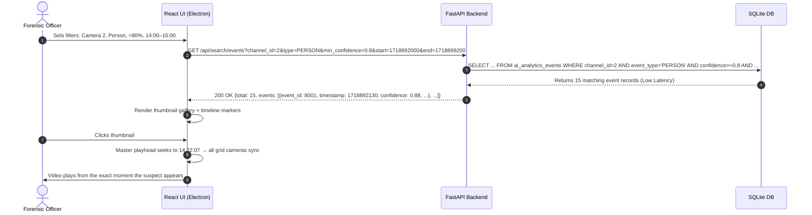

# Feature 07: Evidence Search & Event Filtering

**Back to [[MVP/MVP|MVP]]**

---

## What it Does

After the AI Analytics engine (Feature 06) has finished scanning the carved video clips and populated the SQLite index with thousands of timestamped detection events, the investigator needs a fast, intuitive way to **query** that index.

**Evidence Search** is the query layer that sits between the AI index (SQLite) and the investigator's eyes. It allows the investigator to type natural filter queries like *"Show all persons detected on Camera 2 between 2:00 PM and 4:00 PM with confidence above 80%"* and get instant results — a gallery of thumbnail images with clickable timestamps that jump the video player to the exact frame.

Think of it as the **Google Search Bar** for your CCTV footage.

---

## Why This Feature is Critical

- **Speed:** Without search, the investigator has to manually scrub through 480 camera-days of footage. With search, they get answers with sub-second latency (via indexed SQLite queries).
- **Precision:** The investigator can combine multiple filters (camera + time range + object type + confidence threshold) to narrow down from 10,000 events to the exact 3 they need.
- **Court narrative:** Investigators need to build a chronological timeline of a suspect's movements across cameras. Search makes this possible in minutes, not days.

---

## Key Concepts Explained

### The Library Card Catalog
Before computers, libraries had a **card catalog** — a cabinet full of index cards. If you wanted a book about "World War 2," you didn't walk through every aisle reading every spine. You opened the card catalog drawer labeled "W," found the card, and it told you exactly which shelf to go to.

Evidence Search is the card catalog for CCTV footage. The AI Analytics engine already wrote all the "cards" (detection events with timestamps). This feature is the drawer system and search interface that lets the investigator find the right card instantly.

### What is a Compound Query?
A compound query combines multiple conditions:
- *"Camera 2"* **AND** *"Person"* **AND** *"After 14:00"* **AND** *"Before 16:00"* **AND** *"Confidence > 80%"*

SQLite handles this natively through indexed `WHERE` clauses, returning results with low latency even with 100,000+ events.

---

## Component Responsibility & Architecture

- **FastAPI Engine (Python Layer):** Receives search parameters from the React UI, constructs parameterized SQL queries, executes against `ai_analytics_events`, and returns paginated results with optional thumbnail blobs.
- **SQLite Database:** The indexed `ai_analytics_events` table is the data source. B-Tree indexes on `(channel_id, event_type, start_timestamp)` ensure high-speed, O(log N) query performance.
- **React UI (Electron):** Renders the search bar, filter dropdowns, results gallery, and timeline heatmap markers. Clicking a result seeks the master video playhead to that exact timestamp.

---

## Search Query Parameters

The investigator can filter by any combination of the following:

| Filter | Description | Example |
| :--- | :--- | :--- |
| `channel_id` | Which camera | Camera 2 |
| `event_type` | What was detected | `PERSON`, `VEHICLE`, `MOTION` |
| `min_confidence` | Minimum AI certainty | 0.80 (80%) |
| `start_time` | Time range start | `2026-08-24T14:00:00` |
| `end_time` | Time range end | `2026-08-24T16:00:00` |
| `sort_by` | Result ordering | `timestamp_asc`, `confidence_desc` |
| `page` / `page_size` | Pagination | Page 1, 20 results per page |

---

## The SQL Query Under the Hood

When the investigator applies their filters, the FastAPI backend constructs a query like this:

```sql
SELECT event_id, channel_id, start_timestamp, end_timestamp,
       event_type, confidence, bounding_box, thumbnail_blob
FROM ai_analytics_events
WHERE channel_id = :channel_id
  AND event_type = :event_type
  AND confidence >= :min_confidence
  AND start_timestamp >= :start_time
  AND start_timestamp <= :end_time
ORDER BY start_timestamp ASC
LIMIT :page_size OFFSET :offset;
```

With a B-Tree index on `(channel_id, event_type, start_timestamp)`, this query returns results with **sub-second latency** even on datasets with 100,000+ events.

---

## What the Investigator Actually Sees

### The Search Panel Layout
```
┌─────────────────────────────────────────────────────────┐
│  🔍 Search Evidence                                      │
│  ┌──────────┐ ┌──────────┐ ┌──────────┐ ┌────────────┐ │
│  │ Camera ▼ │ │ Type ▼   │ │ Conf ▼   │ │ Time Range │ │
│  │ Cam 2    │ │ Person   │ │ > 80%    │ │ 14:00-16:00│ │
│  └──────────┘ └──────────┘ └──────────┘ └────────────┘ │
├─────────────────────────────────────────────────────────┤
│  Results: 15 events found                                │
│  ┌─────────┐ ┌─────────┐ ┌─────────┐ ┌─────────┐      │
│  │ [thumb] │ │ [thumb] │ │ [thumb] │ │ [thumb] │      │
│  │ 14:02:10│ │ 14:15:33│ │ 14:22:07│ │ 15:01:45│      │
│  │ 88%     │ │ 91%     │ │ 85%     │ │ 93%     │      │
│  └─────────┘ └─────────┘ └─────────┘ └─────────┘      │
│                                                          │
│  Clicking any thumbnail → video jumps to that timestamp  │
└─────────────────────────────────────────────────────────┘
```

### The Timeline Integration
Search results are also rendered as **colored markers** directly on the master video timeline bar:
- Each search result appears as a small vertical tick mark on the timeline.
- The investigator can visually scan the timeline and see clusters of activity.
- Hovering over a tick shows a tooltip with the detection type and confidence.

---

## Step-by-Step Data Flow Pipeline

```text
1. Investigator Opens Search ──► Selects Camera 2, Person, >80%, 14:00–16:00
                                           │
                                           ▼
2. React UI Sends Query ───────► GET /api/search/events?channel_id=2&type=PERSON&...
                                           │
                                           ▼
3. FastAPI Constructs SQL ─────► Builds parameterized WHERE clause from filters
                                           │
                                           ▼
4. SQLite B-Tree Lookup ───────► Indexed query returns results instantly
                                           │
                                           ▼
5. JSON Response ──────────────► Paginated event list with timestamps + thumbnails
                                           │
                                           ▼
6. Gallery Render ─────────────► React renders thumbnail grid + timeline markers
                                           │
                                           ▼
7. Click-to-Seek ──────────────► Clicking thumbnail → master playhead jumps to timestamp
```

---

## Sequence Diagram



---

## Technical Specifications & APIs

- **Folder Location:** `Projects/locus/MVP/features/evidence-search/`
- **Python Module:** `app.search.query_engine`
- **FastAPI Endpoint:** `GET /api/search/events`
- **Sample Request:**
  ```
  GET /api/search/events?channel_id=2&type=PERSON&min_confidence=0.8&start=1718892000&end=1718899200&sort=timestamp_asc&page=1&page_size=20
  ```
- **Sample Response:**
  ```json
  {
    "total_events": 15,
    "page": 1,
    "page_size": 20,
    "events": [
      {
        "event_id": 8001,
        "channel_id": 2,
        "start_timestamp": 1718892130,
        "end_timestamp": 1718892136,
        "event_type": "PERSON",
        "confidence": 0.88,
        "bounding_box": [120, 80, 200, 350]
      },
      {
        "event_id": 8005,
        "channel_id": 2,
        "start_timestamp": 1718893533,
        "end_timestamp": 1718893540,
        "event_type": "PERSON",
        "confidence": 0.91,
        "bounding_box": [340, 60, 180, 380]
      }
    ]
  }
  ```
