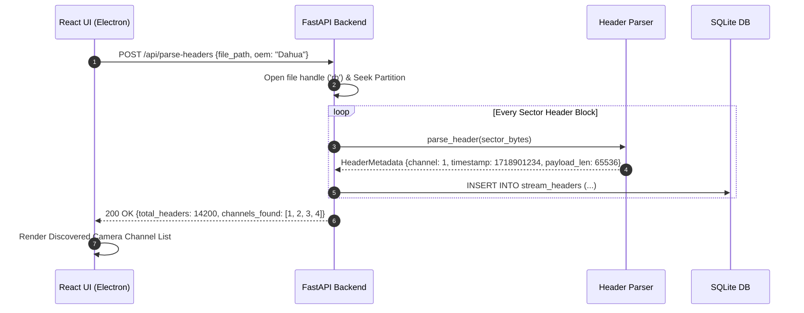

# Feature 03: File System & Header Parsing

**Back to [[MVP/MVP|MVP]]**

---

## 📍 System Status After Stage 2 (What We Know vs. What We Need)

At the end of **Stage 2 (Device Identification)**, Locus has established the high-level evidence baseline:
- **What We Know:** We know the manufacturer (`Dahua Technology`), filesystem type (`DHFS v2.1`), total drive size (`500 MB`), baseline SHA-256 hash, and number of camera channels (`8 Channels`).
- **What We DO NOT Know Yet:** We do **not** know where individual camera recordings start or end, which physical disk sectors belong to Camera 1 vs Camera 4, where deleted footage is hidden, or what time specific frames were recorded.

---

##  What is a Sector & How DVRs Store Interleaved Data

### 1. What is a Disk Sector?
A hard drive is divided into millions of tiny physical storage blocks called **Sectors** (usually **512 bytes** of binary data per sector). 

### 2. How DVRs Store Intermixed Data Across Sectors
Normal computers save a file in continuous blocks with a table of contents. CCTV DVRs/NVRs do not. Because 4, 8, or 16 cameras record simultaneously 24/7, the DVR dumps video frames sequentially onto sectors as they arrive in real-time.

This creates an **interleaved (intermixed) sector stream**:

$$\text{Sector 100 (Cam 1)} \longrightarrow \text{Sector 101 (Cam 3)} \longrightarrow \text{Sector 102 (Cam 2)} \longrightarrow \text{Sector 103 (Cam 1)}$$

### 3. The 32-Byte "Digital Shipping Label" (Header)
To keep track of this chaotic sector ocean, the DVR attaches a tiny **32-byte binary header** (the "Shipping Label") directly at the start of each frame payload on the sector.

That 32-byte header contains secret binary coded fields:
- `Magic String`: Signature verification (`DHAV` or `HKFS`).
- `Channel ID`: Identifies which camera recorded the frame (`0x01` = Camera 1).
- `Timestamp`: UTC epoch timestamp (`1718901234`).
- `Payload Length`: Exact byte size of the video frame (`65536` bytes).
- `Frame Type`: `I-Frame` (Keyframe / Full Picture) vs `P-Frame` (Delta frame).

---

## Why Stage 3 is Mandatory for Stage 4 (Carving)

Without Stage 3, Stage 4 (Carving) cannot extract video because it wouldn't know which sectors belong to which camera or where a video frame starts and ends.

**Stage 3 (Header Parsing)** scans the drive sector-by-sector, unpacks the 32-byte binary headers using Python `struct.unpack()`, and builds a **Master Sector Map** in SQLite (`stream_headers` table). 

This Master Sector Map tells Stage 4: *"Sectors 100, 103, 108 belong to Camera 1 starting at 14:00:00 UTC."* Stage 4 can then cleanly slice those sectors and remux them into a perfect `.mp4` video clip for Camera 1!

---

## Component Responsibility & Architecture

- **FastAPI Engine (Python Layer):** Seeks through partition sectors using Python `struct.unpack()`, decodes binary C-struct headers, and maps intermixed streams to specific camera channel queues.
- **Header Parser Registry:** Decodes specific OEM header structures (`DahuaHeaderParser`, `HikvisionHeaderParser`, `CPPlusHeaderParser`).
- **SQLite Database:** Writes stream index records into the `stream_headers` table so the carving engine knows where video chunks start and end.
- **React UI (Electron):** Displays discovered camera channel list with frame count and date/time ranges per camera.

---

## SQLite Database Schema (`stream_headers`)

| Field Name | Data Type | Sample Value | Purpose |
| :--- | :--- | :--- | :--- |
| `id` | `INTEGER` (PK) | `1001` | Header Index ID |
| `evidence_id` | `TEXT` (FK) | `"ev_101"` | Parent disk image ID |
| `sector_offset` | `INTEGER` | `8192` | Physical sector byte offset |
| `channel_id` | `INTEGER` | `1` | Extracted camera channel number |
| `timestamp_epoch`| `INTEGER` | `1718901234` | Extracted UTC epoch timestamp |
| `frame_type` | `TEXT` | `"I-FRAME"` | Keyframe vs Delta frame |
| `payload_len` | `INTEGER` | `65536` | Video payload size in bytes |

---

## Step-by-Step Data Flow Pipeline

```text
1. Trigger Event ───────────────► Device identified -> triggers `POST /api/parse-headers`
                                           │
                                           ▼
2. Sector Seek Engine ──────────► Python seeks to partition sector offsets
                                           │
                                           ▼
3. Binary `struct.unpack()` ────► Unpacks 32-byte header into C-struct variables
                                           │
                                           ▼
4. OEM Header Translator ───────► Extracts `channel_id`, `timestamp`, `frame_type`, `length`
                                           │
                                           ▼
5. SQLite Database Indexing ────► Inserts header records into `stream_headers` table
                                           │
                                           ▼
6. React UI Update ─────────────► Displays discovered channel list (e.g., Camera 1: 4,200 frames)
```

---

## Sequence Diagram



---

## Technical Specifications & APIs

- **Folder Location:** `Projects/locus/MVP/features/filesystem-parsing/`
- **Python Module:** `app.carving.parsers`
- **FastAPI Endpoint:** `POST /api/parse-headers`
- **Sample Request Payload:**
  ```json
  {
    "file_path": "/storage/evidence/dvr_dahua_500mb.dd",
    "oem": "Dahua Technology"
  }
  ```
- **Sample Response Payload:**
  ```json
  {
    "status": "completed",
    "headers_parsed": 14200,
    "channels_discovered": [1, 2, 3, 4],
    "first_timestamp": 1718900000,
    "last_timestamp": 1718986400
  }
  ```
