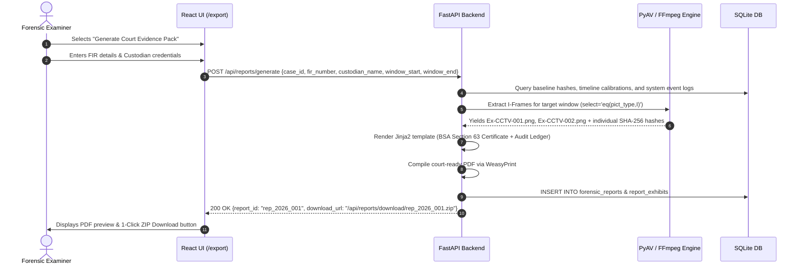

# Feature 09: Forensic Reporting & Statutory Admissibility (BSA 2023 Section 63)

**Back to [[MVP/MVP|MVP]]**

---

## What it Does

In a forensic investigation, discovering evidence inside the software is only half the battle. If that evidence cannot be **admitted into a court of law**, the entire investigation is void. 

**Feature 09: Forensic Reporting & Statutory Admissibility** transforms Locus's technical carving, timeline calibrations, and cryptographic audits into a courtroom-ready **Evidence Production Package**. It automates the generation of:

1. **The Statutory BSA 2023 Section 63 Compliance Certificate:**  
   The mandatory legal certificate under the **Bharatiya Sakshya Adhiniyam (BSA) 2023** (which replaced Section 65B of the Indian Evidence Act 1872). It certifies lawful custody, device health, and bitstream integrity, signed by the device custodian and the forensic examiner.
2. **The Comprehensive Forensic Case Report (PDF):**  
   A detailed technical document containing case provenance (FIR number, police station, investigating officer), physical hardware metadata, dual baseline cryptographic hashes (SHA-256 + MD5), carved clip inventories, and AI detection summaries.
3. **The 1-Click Numbered I-Frame Stills Exhibit Pack:**  
   Indian police charge sheets require printed paper annexures. Locus automatically carves uncompressed **I-Frame (Keyframe) stills** as PNG images across the incident window, assigns sequential court exhibit numbers (`Ex-CCTV-001.png`), computes individual SHA-256 hashes, and formats them into an itemized exhibit list.
4. **The Clock Drift Calibration Annexure:**  
   A mathematical breakdown documenting the on-scene NTP wristwatch anchor, DVR OSD offset, and linear backward drift calculations, defending the timeline against cross-examination when compared with Call Detail Records (CDR) and mobile tower dumps.
5. **The DVR System Log Integrity Statement (*Tomaso Bruno* Defense):**  
   An affirmative declaration cross-referencing motion voids against the recorder's internal system logs to prove that recording gaps resulted from sensor inactivity, legally refuting allegations of evidence destruction or suppression under **BSA 2023 Section 119**.

---

## Why This Feature is Critical

- **Mandatory Legal Gatekeeper (*Anvar P.V. v P.K. Basheer*):** In Indian jurisprudence, electronic records are completely inadmissible without a contemporaneous Section 63 certificate signed by the lawful custodian.
- **Defense Against Evidence Suppression (*Tomaso Bruno v State of UP*):** Missing CCTV timelines trigger an adverse presumption against the prosecution. Locus's log-verified gap statements provide affirmative proof that no motion occurred.
- **Physical Courtroom Annexures:** Judges and defense advocates require printed, high-resolution I-frame stills where burned-in OSD timestamps and suspect features cannot be distorted by video player compression artifacts.
- **Eliminating Manual Bureaucratic Overhead:** Forensic examiners currently spend hours manually typing disk hashes, calculating clock drift on paper, and drafting Section 65B/63 certificates. Locus generates the entire package in one click.

---

## Key Concepts Explained

### 1. The BSA 2023 Section 63 Statutory Declarations
Under Section 63(4) of the Bharatiya Sakshya Adhiniyam 2023, a certificate must state:
1. **Device Identification:** Identifying the electronic record and describing the manner in which it was produced (e.g., CP Plus 8-Channel DVR, Serial `CP-1029384`, Seagate 4 TB HDD Serial `WCA1234567`).
2. **Device Working Condition:** Stating that the device was operating properly throughout the period, or that any temporary malfunction did not affect the accuracy of the record.
3. **Ordinary Course of Business:** Declaring that the surveillance recording was generated as part of ordinary security operations and remained in lawful custody.
4. **Custodian Sign-Off:** Signed by the person occupying a responsible official position in relation to the operation of the device (shop proprietor, bank manager, IT admin) alongside the cyber cell examiner.

### 2. Standalone I-Frames vs. Predictive P/B Frames in Court
H.264 and H.265 video streams use **Groups of Pictures (GOP)**:
- **I-Frames (Keyframes):** Contain 100% of the image data. They are independently decodable and visually complete, with burned-in OSD timestamps locked into the pixel raster.
- **P-Frames & B-Frames:** Contain only motion vector deltas relative to prior frames. Slicing a P-frame out of context results in corrupted, smeary images.
- **Courtroom Standard:** Locus strictly extracts **I-Frames** for still-photo court exhibits. Every extracted still is hashed with SHA-256 so the defense can verify its byte-for-byte derivation from the master bitstream image.

### 3. The Dual Timestamp Table (Raw OSD vs. Calibrated IST)
To eliminate confusion in court, the report produces a synchronization matrix:
$$\text{Calibrated IST Wall Time} = t_{\text{DVR}} - \left[\Delta t_{\text{seizure}} - (\text{Drift Rate} \times \text{Days Elapsed})\right]$$
The report lists:
* Target Incident Event: `Suspect enters through rear door`
* Raw Burned-in DVR OSD Time: `21:42:35`
* Calibrated Real-World IST Time: `21:45:35` (reconciles with Mobile Tower Ping at `21:45:30 IST`).

---

## Component Responsibility & Architecture

- **Report Generator (`app.modules.reporting.service`):** Python service compiling case metadata, baseline hashes, calibrated timeline tables, and carved clip inventories into structured context.
- **Jinja2 / HTML-to-PDF Engine (WeasyPrint / Headless Chromium):** Renders court-compliant, paginated PDF reports using formal Indian judicial typography and watermarked header/footer numbering (`Page X of Y`).
- **I-Frame Extraction Pipeline (PyAV / FFmpeg):** Executes filter `select='eq(pict_type,I)'` to extract uncompressed PNG stills for the target window and calculates individual SHA-256 hashes.
- **SQLite Database (`forensics.db`):** Persists generated report metadata (`forensic_reports`) and individual exhibit links (`report_exhibits`).
- **React Frontend (`/export` Studio Room):** Provides an interactive modal to enter officer/custodian details, select target exhibit frames, preview the Section 63 certificate, and download the full ZIP evidence package.

---

## SQLite Database Schemas

### `forensic_reports`
Stores metadata and provenance for each generated forensic report.

| Column Name | Data Type | Sample Value | Purpose |
| :--- | :--- | :--- | :--- |
| `report_id` | `TEXT` (PK) | `"rep_2026_001"` | Unique report identifier |
| `case_id` | `TEXT` (FK) | `"case_001"` | Associated case ID |
| `report_title` | `TEXT` | `"Surveillance Forensic Analysis Report"` | Official document title |
| `fir_number` | `TEXT` | `"FIR 142/2026"` | Police FIR / Crime Reference Number |
| `police_station` | `TEXT` | `"Cyber Crime PS, Pune"` | Jurisdiction police station |
| `examiner_name` | `TEXT` | `"Inspector Rajesh Sharma"` | Investigating forensic examiner |
| `examiner_badge` | `TEXT` | `"MH-CYBER-882"` | Badge / Identification number |
| `custodian_name` | `TEXT` | `"Anand Shah"` | Shop proprietor / Lawful custodian |
| `custodian_designation` | `TEXT` | `"Proprietor, Surat Jewellery"` | Official position of custodian |
| `baseline_sha256` | `TEXT` | `"a3f12c...889b"` | SHA-256 hash of raw source image |
| `baseline_md5` | `TEXT` | `"e2fc71...31da"` | MD5 hash of raw source image |
| `clock_drift_summary` | `TEXT` | `"DVR was 3m 0s slow at seizure"` | Clock drift finding |
| `pdf_path` | `TEXT` | `"/cases/CASE_001/reports/report.pdf"` | Local filesystem path to PDF |
| `created_at` | `DATETIME` | `"2026-09-05 01:45:00"` | Timestamp of generation |

### `report_exhibits`
Stores itemized still-frame exhibits included in the courtroom annexure.

| Column Name | Data Type | Sample Value | Purpose |
| :--- | :--- | :--- | :--- |
| `exhibit_id` | `TEXT` (PK) | `"ex_001"` | Unique exhibit ID |
| `report_id` | `TEXT` (FK) | `"rep_2026_001"` | Parent report ID |
| `exhibit_number` | `TEXT` | `"Ex-CCTV-01"` | Formal court exhibit label |
| `channel_id` | `INTEGER` | `1` | Camera channel number |
| `frame_number` | `INTEGER` | `4120` | Sector/stream frame sequence |
| `raw_osd_timestamp` | `TEXT` | `"2026-06-12 21:42:35"` | Time burned into video pixels |
| `calibrated_ist` | `TEXT` | `"2026-06-12 21:45:35"` | Calibrated real-world wall time |
| `image_sha256` | `TEXT` | `"d41d8c...57e0"` | SHA-256 hash of the extracted PNG |
| `file_path` | `TEXT` | `"/cases/CASE_001/exhibits/Ex-01.png"` | Filepath of the uncompressed PNG |
| `description` | `TEXT` | `"Suspect face capture at entrance"` | Examiner observation |

---

## Step-by-Step Execution Pipeline

```text
1. Case Verification ──────────► Validate baseline SHA-256/MD5 hashes against source disk image
                                           │
                                           ▼
2. Calibration Reconciliation ──► Extract Seizure Anchor & compute calibrated IST timeline table
                                           │
                                           ▼
3. I-Frame Exhibit Carving ────► PyAV extracts uncompressed PNG keyframes & calculates SHA-256
                                           │
                                           ▼
4. System Log Integration ─────► Compile log verification statement for motion-only gaps
                                           │
                                           ▼
5. Certificate Assembly ───────► Jinja2 renders BSA 2023 Section 63 statutory certificate
                                           │
                                           ▼
6. PDF Compilation ────────────► WeasyPrint compiles complete court pack with hash parity tables
                                           │
                                           ▼
7. ZIP Package Export ─────────► Bundles PDF + Numbered PNGs + .sync.json sidecars into export archive
```

---

## Sequence Diagram



---

## Technical Specifications & APIs

- **Folder Location:** `Projects/locus/MVP/features/forensic-reporting/`
- **Python Module:** `app.modules.reporting.service`
- **FastAPI Endpoints:**
  - `POST /api/reports/generate` — Compiles the complete evidence pack and Section 63 certificate.
  - `GET /api/reports/{case_id}` — Lists all generated reports for a case.
  - `GET /api/reports/{report_id}/download` — Downloads the complete ZIP archive (PDF report, numbered I-frame PNG exhibits, `.sync.json` audit sidecars).
  - `POST /api/reports/export-iframes` — Standalone endpoint to extract I-frames with individual hashes across any selected time range.

- **Sample Request Payload (`POST /api/reports/generate`):**
  ```json
  {
    "case_id": "CASE_2026_089",
    "fir_number": "FIR 112/2026",
    "police_station": "Cyber Crime PS, Ahmedabad",
    "examiner_name": "Insp. V. K. Patel",
    "examiner_badge": "GJ-CY-401",
    "custodian_name": "Rameshchandra Soni",
    "custodian_designation": "Proprietor, Ambika Jewellers",
    "incident_start_ist": "2026-06-12T21:30:00+05:30",
    "incident_end_ist": "2026-06-12T22:15:00+05:30",
    "include_iframes": true,
    "iframe_interval_seconds": 2
  }
  ```

- **Sample Response Payload:**
  ```json
  {
    "status": "success",
    "report_id": "rep_2026_089_01",
    "pdf_filename": "CASE_2026_089_BSA63_Report.pdf",
    "total_exhibits_extracted": 16,
    "baseline_sha256_verified": true,
    "bsa_section_63_compliant": true,
    "download_url": "/api/reports/download/rep_2026_089_01.zip"
  }
  ```
