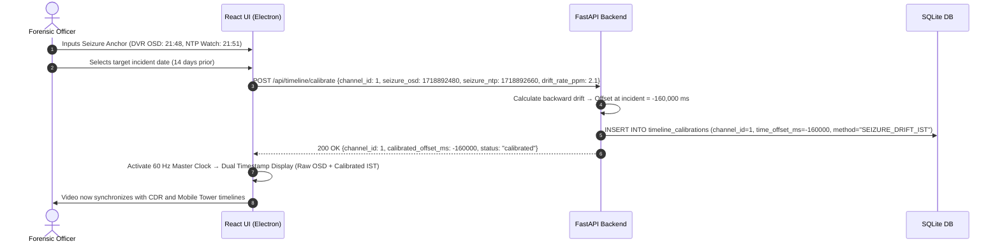

# Feature 05: Timeline Synchronization & Multi-Camera Alignment

**Back to [[MVP/MVP|MVP]]**

---

## What it Does

After Video Carving (Feature 04) produces playable `.mp4` clips for each camera channel, the investigator needs to watch multiple cameras **side by side**, perfectly synchronized to the same real-world second. 

The problem is that DVR clocks are almost always wrong. Camera 1 might think it's 2:00 PM, Camera 2 might think it's 2:05 PM, and Camera 3 might have reset to January 1st, 2000 because its battery died. If you just press "Play" on all three based on their raw timestamps, they will be completely out of sync.

**Timeline Synchronization** solves this by:
1. Letting the investigator identify a **common real-world event** visible on multiple cameras (like a flash of lightning or a door opening).
2. Calculating the exact time offset between each camera's broken clock and the real world.
3. Applying that offset as a **virtual correction layer** (without modifying the original video files) so all cameras play in perfect sync.

---

## Why This Feature is Critical

- **Cross-camera tracking:** To follow a suspect walking from one camera's field of view into another, the investigator needs both cameras aligned to the exact same second.
- **Incident reconstruction:** Courts and juries need to see events from multiple angles simultaneously to understand what happened.
- **Clock drift is universal:** In real forensic casework, it is extremely rare for a DVR clock to be correct. Most are off by minutes, some by hours or even years.

---

## Key Concepts Explained

### The Three Clocks Problem
A DVR video actually has three different clocks, and they often disagree:
1. **The Motherboard Clock (Header Timestamp):** Invisible metadata inside the file. Often wrong if the DVR battery dies or was never configured.
2. **The Internal Metronome (PTS/DTS):** Tells the video player how fast to play the frames. It doesn't know the real time — it just counts "Tick 1, Tick 2, Tick 3."
3. **The Burned-In Clock (OSD):** The physical pixels painted onto the screen corner showing the date and time. Visible to humans, but invisible to software.

### The Sticky Note Rule (Non-Destructive Calibration)
We **cannot** edit the original video files to fix broken timestamps — in a court of law, that is called **tampering with evidence**, and it will get the evidence thrown out.

Instead, Locus leaves the raw files completely untouched and creates a "Sticky Note" in the SQLite database that says: *"Camera 2 is exactly 5 minutes too fast."* When playing the video, Locus reads the sticky note and virtually shifts the video on the screen. The original bytes are never modified.

### The Offset and the Drift
- **Offset (Δt):** A static time shift. If the camera is 5 minutes fast, the offset is `-5 minutes`. Simple addition.
- **Drift (α):** Cheap DVR clocks run slightly too fast or too slow, gaining or losing a few seconds every week. Drift is a tiny rate correction (measured in parts per million) that stretches or shrinks the timeline slightly so the video stays in sync even over 30-day recordings.

### The Master Clock (Orchestra Conductor)
Imagine 16 musicians (16 cameras) trying to play a song together. Without a conductor, it sounds terrible. In Locus, the **Master Clock** is the conductor. It ticks 60 times per second. At every tick, it tells each camera: *"Based on your sticky note, show me the frame you should be displaying right now."*

---

## Component Responsibility & Architecture

- **FastAPI Engine (Python Layer):** Stores and retrieves calibration offsets from SQLite. Computes normalized timestamps on the fly when the frontend requests frame data for a specific master-clock position.
- **Master Playhead Coordinator (Frontend Bus):** A 60 Hz loop in the React UI that maintains a single master timeline position. All camera grid tiles are slave consumers of this clock.
- **Calibration Workflow Engine:** Handles the three calibration methods (Visual Anchor, OSD Baseline, External Incident Anchor) and writes offsets to `timeline_calibrations`.
- **SQLite Database:** Stores camera channel metadata (`camera_channels`) and non-destructive time correction layers (`timeline_calibrations`).
- **React UI (Electron):** Displays a multi-camera grid (2x2, 3x3, or 4x4) with a unified master timeline scrubber.

---

## SQLite Database Schemas

### `camera_channels`
Stores metadata and capture profiles for each discovered channel.

| Column Name | Data Type | Sample Value | Purpose |
| :--- | :--- | :--- | :--- |
| `channel_id` | `INTEGER` (PK) | `2` | Camera channel ID |
| `channel_name` | `TEXT` | `"Front Door"` | Human-readable name |
| `source_dvr_id` | `TEXT` | `"ev_101"` | Parent evidence ID |
| `nominal_fps` | `REAL` | `25.0` | Capture frame rate |
| `total_frames` | `INTEGER` | `90000` | Total frame count |
| `earliest_raw_timestamp` | `INTEGER` | `1718900000` | First raw header timestamp |
| `latest_raw_timestamp` | `INTEGER` | `1718986400` | Last raw header timestamp |
| `has_audio` | `BOOLEAN` | `FALSE` | Whether audio exists |

### `timeline_calibrations`
Stores the non-destructive time correction applied to each channel.

| Column Name | Data Type | Sample Value | Purpose |
| :--- | :--- | :--- | :--- |
| `calibration_id` | `INTEGER` (PK) | `1` | Calibration record ID |
| `channel_id` | `INTEGER` (FK) | `2` | Target camera channel |
| `time_offset_ms` | `INTEGER` | `-300000` | Static offset in milliseconds (-5 min) |
| `drift_rate_ppm` | `REAL` | `1.5` | Clock drift in parts per million |
| `anchor_raw_timestamp` | `INTEGER` | `1718901234` | The raw timestamp used as the reference point |
| `anchor_calibrated_utc` | `INTEGER` | `1718901534` | The known real-world time at that reference |
| `seizure_ntp_epoch` | `INTEGER` | `1718902000` | NTP wall time captured on scene at seizure |
| `seizure_osd_epoch` | `INTEGER` | `1718902180` | DVR on-screen display time at seizure |
| `calibration_method` | `TEXT` | `"SEIZURE_DRIFT_IST"` | How offset was determined (`SEIZURE_DRIFT_IST`, `OSD_VISUAL`, `INCIDENT_ANCHOR`) |
| `calibrated_by` | `TEXT` | `"Officer Smith"` | Who performed the calibration |

---

## Calibration Workflows (How the Investigator Syncs Cameras)

### Method 1: Visual Anchor Alignment (Most Common)
1. The investigator is watching Camera 1 and Camera 2 side by side.
2. They notice a flash of lightning (or a car crash, or a light turning on) visible on **both** cameras.
3. They pause Camera 1 at the exact frame of the flash — the header timestamp says `14:00:00`.
4. They pause Camera 2 at the same flash — the header timestamp says `14:05:10`.
5. They click **"Set Anchor"**. Locus calculates: Camera 2 is `+5 minutes 10 seconds` ahead → stores `time_offset_ms = -310000`.
6. Now when they press Play, both cameras show the flash at the exact same moment on the master timeline.

### Method 2: Burned-In OSD Time Baseline
1. The investigator pauses on a frame where the burned-in clock is clearly visible (e.g., the OSD says `14:00:00`).
2. They type `14:00:00` into the calibration dialog.
3. Locus compares the header timestamp at that frame (`13:55:00`) and calculates the offset (`+5 minutes`).

### Method 3: External Incident Anchor
1. The investigator has a police dispatch log (CAD) or Call Detail Record (CDR) that says "Call received / Tower ping at exactly `14:22:33 IST`."
2. They find the moment the phone rings or the suspect raises their phone on the CCTV and anchor it to `14:22:33`.

### Method 4: On-Scene Seizure Anchor & Linear Drift Propagation (Forensic Standard)
In real-world Indian casework (per State FSL & CFSL protocols), DVRs run on un-synchronized RTC chips that drift **1 to 5 minutes per month**. To map burned-in video timestamps to Real-World Wall Time (Indian Standard Time / IST):
1. **On-Scene Seizure Anchor:** The investigating officer photographs the live DVR monitor screen displaying the on-screen clock alongside an NTP-synchronized wristwatch/device in the same camera frame.
   - *Example:* At seizure, DVR OSD reads `21:48:00 IST`, while the NTP watch reads `21:51:00 IST` (DVR is 3 minutes slow; $\Delta t_{\text{seizure}} = -180\text{ s}$).
2. **Linear Drift Propagation Calculation:** If the crime occurred 14 days prior to seizure, Locus propagates the drift rate backwards assuming typical standalone RTC quartz drift:
   $$\Delta t(t) = \Delta t_{\text{seizure}} - \left[\text{Drift Rate (min/day)} \times \text{Days Prior}\right]$$
   $$\text{Calibrated IST Wall Time}(t) = t_{\text{DVR}} - \Delta t(t)$$
3. **Dual Timestamp Display:** Locus displays both timestamps simultaneously on the playback head:
   - **`[Raw OSD Time: 21:42:35]`** (preserves pixel fidelity for cross-examination).
   - **`[Calibrated IST: 21:45:35]`** (enables 1:1 correlation with CDR, mobile tower dumps, and police GD diary entries).

---

## Step-by-Step Data Flow Pipeline

```text
1. Channel Discovery ──────────► After carving, populate `camera_channels` from `stream_headers`
                                           │
                                           ▼
2. Calibration Trigger ────────► Officer inputs Seizure Photo Anchor (DVR OSD vs. NTP Watch)
                                           │
                                           ▼
3. Offset & Drift Math ────────► Locus computes linear drift rate backwards to incident date
                                           │
                                           ▼
4. SQLite Calibration Write ───► INSERT into `timeline_calibrations` (non-destructive sticky note)
                                           │
                                           ▼
5. Master Playhead Activation ─► 60 Hz master loop starts with Dual Timestamp readouts (Raw & IST)
                                           │
                                           ▼
6. Synchronized Grid Playback ─► All cameras display frames for the exact same real-world second
```

---

## Sequence Diagram



---

## Handling Edge Cases

- **Mixed Frame Rates:** If Camera 1 records at 30 FPS and Camera 2 at 10 FPS, the Master Clock tells Camera 2 to hold its current frame on screen for 3 ticks until its next timestamp arrives. No synthetic frames are generated.
- **Motion-Only Recording Gaps & The *Tomaso Bruno* Presumption Defense:**
  Over 80% of small-business DVRs in India record on motion detection. Gaps between motion events look identical on-disk to deleted footage. Under the Supreme Court's ruling in *Tomaso Bruno v State of UP (2015)* and **BSA 2023 Section 119**, unexplained gaps create an adverse presumption against the prosecution (evidence suppression).
  - Locus inspects parsed **DVR System Event Logs** (alarm logs, sensor triggers, power states).
  - If a gap is logged as sensor inactivity, Locus displays: `[ SENSOR IDLE — NO MOTION DETECTED (VERIFIED BY SYSTEM LOG) ]` with a green forensic verification badge.
  - If a gap coincided with power loss: displays `[ RECORDER POWER FAILURE EVENT LOGGED ]`.
  - This affirmatively proves to the court that footage was never recorded, defeating defense claims of evidence deletion.
- **Frame-by-Frame Scrubbing:** Pressing the "Next Frame" button advances the master clock by the smallest frame delta among all active channels (e.g., 33ms for a 30 FPS camera), so no detail is ever skipped.

---

## Technical Specifications & APIs

- **Folder Location:** `Projects/locus/MVP/features/timeline-sync/`
- **Python Module:** `app.timeline.calibrator`
- **FastAPI Endpoints:**
  - `POST /api/timeline/calibrate` — Apply a new calibration offset
  - `GET /api/timeline/normalized?channel_id=2&target_time=1718892000` — Get the raw seek timestamp for a given normalized time
- **Sample Calibration Request:**
  ```json
  {
    "channel_id": 2,
    "time_offset_ms": -310000,
    "drift_rate_ppm": 0.0,
    "anchor_raw_timestamp": 1718892310,
    "anchor_calibrated_utc": 1718892000,
    "calibration_method": "OSD_VISUAL",
    "calibrated_by": "Officer Smith"
  }
  ```
- **Sample Normalized Seek Response:**
  ```json
  {
    "channel_id": 2,
    "target_master_time": 1718892000,
    "seek_raw_timestamp": 1718892310,
    "sector_offset": 1450204,
    "payload_length": 65536
  }
  ```
