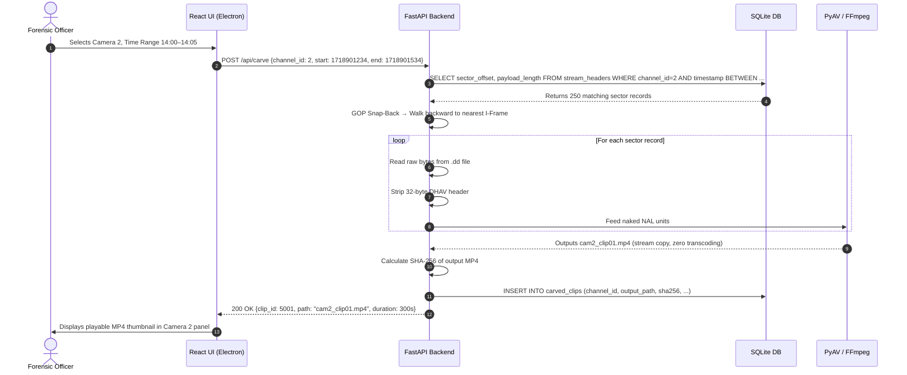

# Feature 04: Video Carving & Stream Remuxing

**Back to [[MVP/MVP|MVP]]**

---

## What it Does

After Stage 3 (Header Parsing) has scanned the entire disk and built a **Master Sector Map** inside SQLite, Locus now knows exactly where every video frame lives on the hard drive. But those frames are trapped inside proprietary wrappers (like Dahua's `DHAV` container) and are scattered across random physical sectors, interleaved with frames from other cameras.

**Video Carving** is the process of:
1. Reading the raw sector data from the disk image based on the Master Sector Map.
2. Stripping off the proprietary 32-byte wrapper headers (e.g., `DHAV`).
3. Assembling the naked H.264/H.265 video frames into proper playback order.
4. Wrapping them into a standard `.mp4` container using FFmpeg (PyAV) — **without re-encoding a single pixel**.

The result is a set of clean, web-playable `.mp4` video clips that any standard media player (or our React frontend) can play instantly.

---

## Why This Feature is Critical

- **Raw DVR sectors are unplayable.** No media player on Earth can open a `.dd` disk image and play interleaved proprietary sector data.
- **Recovers deleted footage.** Even if the DVR's file index table is wiped, the raw video frames still physically exist on the disk platters. Carving recovers them directly from the sectors, bypassing the file index entirely.
- **Zero-Transcoding = Forensic Integrity.** Re-encoding the video (changing pixel data) would alter the file hash, making it inadmissible in court. Locus uses FFmpeg `stream copy` mode (`-c:v copy`) which simply moves the raw compressed bytes into a new container without touching the pixel data.

---

## Key Concepts Explained

### What is a GOP (Group of Pictures)?
Video is not stored as individual full images. Instead, it uses a compression trick:
- **I-Frame (Keyframe):** A complete, standalone picture (like a full photograph).
- **P-Frame (Predicted Frame):** Only stores the *difference* from the previous frame (like saying "everything is the same, except this person moved 2 pixels to the left").

A GOP is a sequence that starts with one I-Frame followed by several P-Frames:
```
[I] [P] [P] [P] [P] [I] [P] [P] [P] [P] ...
 └────── GOP 1 ──────┘ └────── GOP 2 ──────┘
```

### Why GOP Alignment Matters
If we start carving from a P-Frame instead of an I-Frame, the video player has no "base picture" to work with, causing **green screen glitches** (corrupted frames). Locus always snaps the carving start-point to the nearest I-Frame (IDR Keyframe with SPS/PPS headers).

### What is Remuxing?
**Remuxing** means taking the compressed video data out of one container and putting it into another container — like moving a letter from a red envelope into a blue envelope without changing the letter itself. The video bytes remain bit-for-bit identical; only the packaging changes (from `DHAV` to `.mp4`).

---

## Component Responsibility & Architecture

- **FastAPI Engine (Python Layer):** Receives a carving request (channel ID + time range), queries `stream_headers` for matching sector offsets, reads raw bytes from the `.dd` file, strips proprietary headers, and feeds naked NAL units to PyAV.
- **PyAV / FFmpeg (Remuxing Engine):** Receives raw H.264/H.265 byte streams and writes them into an `.mp4` container using stream copy mode. No transcoding occurs.
- **GOP Alignment Module:** Scans for the nearest I-Frame (IDR with SPS/PPS) before the requested start time, ensuring clean video playback.
- **SQLite Database:** Reads from `stream_headers` (input) and writes to `carved_clips` (output) to track what has been extracted.
- **React UI (Electron):** Displays a list of carved clips per camera channel with thumbnail previews and duration.

---

## SQLite Database Schema (`carved_clips`)

| Column Name | Data Type | Sample Value | Purpose |
| :--- | :--- | :--- | :--- |
| `clip_id` | `INTEGER` (PK) | `5001` | Unique carved clip ID |
| `evidence_id` | `TEXT` (FK) | `"ev_101"` | Parent disk image ID |
| `channel_id` | `INTEGER` | `2` | Camera channel this clip belongs to |
| `start_sector` | `INTEGER` | `1450204` | First physical sector offset |
| `end_sector` | `INTEGER` | `1461900` | Last physical sector offset |
| `start_timestamp` | `INTEGER` | `1718901234` | Start time (epoch) |
| `end_timestamp` | `INTEGER` | `1718901534` | End time (epoch) |
| `duration_seconds` | `REAL` | `300.0` | Clip duration |
| `output_path` | `TEXT` | `"/output/cam2_clip01.mp4"` | Path to the carved MP4 file |
| `sha256_hash` | `TEXT` | `"9f86d081884c..."` | Hash of the carved output file |
| `frame_count` | `INTEGER` | `7500` | Total frames in the carved clip |
| `gop_aligned` | `BOOLEAN` | `TRUE` | Confirms carving started at an I-Frame |

---

## Step-by-Step Data Flow Pipeline

```text
1. Carving Request ─────────────► `POST /api/carve` with channel_id + time range
                                           │
                                           ▼
2. SQLite Sector Lookup ────────► Queries `stream_headers` for matching sector offsets
                                           │
                                           ▼
3. GOP Snap-Back ───────────────► Walks backward to the nearest I-Frame (IDR Keyframe)
                                           │
                                           ▼
4. Raw Byte Extraction ─────────► Reads raw sector bytes from `.dd` file handle
                                           │
                                           ▼
5. Proprietary Header Strip ────► Removes 32-byte `DHAV` wrappers, exposing naked NAL units
                                           │
                                           ▼
6. PyAV Remux (Stream Copy) ───► Writes raw H.264 bytes into `.mp4` container (zero transcoding)
                                           │
                                           ▼
7. Output Hash Calculation ─────► SHA-256 hash of the new `.mp4` file
                                           │
                                           ▼
8. SQLite Record ───────────────► INSERT into `carved_clips` with metadata + hash
                                           │
                                           ▼
9. React UI Update ─────────────► Displays carved clip thumbnail in the channel panel
```

---

## Sequence Diagram



---

## Technical Specifications & APIs

- **Folder Location:** `Projects/locus/MVP/features/video-carving/`
- **Python Module:** `app.carving.carver`
- **FastAPI Endpoint:** `POST /api/carve`
- **Sample Request Payload:**
  ```json
  {
    "evidence_id": "ev_101",
    "channel_id": 2,
    "start_timestamp": 1718901234,
    "end_timestamp": 1718901534
  }
  ```
- **Sample Response Payload:**
  ```json
  {
    "status": "carved",
    "clip_id": 5001,
    "channel_id": 2,
    "output_path": "/output/cam2_clip01.mp4",
    "duration_seconds": 300.0,
    "frame_count": 7500,
    "sha256": "9f86d081884c7d659a2feaa0c55ad015a3bf4f1b2b0b822cd15d6c15b0f00a08",
    "gop_aligned": true
  }
  ```

---

## Plain English Summary

**The Envelope Analogy:** Imagine someone mailed you a letter, but it's sealed inside a weird foreign envelope that you can't open with normal tools. Video Carving is the process of carefully slicing open that foreign envelope (the `DHAV` wrapper), taking out the original letter (the raw H.264 video data) without damaging it, and placing it into a standard envelope (the `.mp4` container) that anyone in the world can open and read. The letter itself (the pixels) is never altered — only the packaging changes.
